# Ds2vJoy
DualShock™ and DualSense™ to vJoy or ViGEm for Windows 64 bits only

Fork from @090 DS4vJoy and DS5vJoy projects
- Bluetooth compatible
- Vibration compatible (If you select vJoy or ViGEm from the game, the operation of DS4 will be reflected)
- Combinations, modes (known as shifted), macros and time based operations allowed
- Control complex mouse operations
- HidGuardian included to let the game only see the needed vJoy or ViGEm joystick

## How to use
1. Install vJoy (https://sourceforge.net/projects/vjoystick/)
   * or not if you plan to use ViGEm
2. Open 'Configure vJoy' and select Axes, up to 128 Buttons and up to 4 continuous POV and effects
   * It may result in a PC restart.
3. Launch Ds2vJoy.exe
   * an .ini file will be created, to save parameters, with some examples already filled
   * and needed .dll, whose will be destroyed when you'll exit
4. Connect your PC and DS4/DS5 via USB or Bluetooth 
5. Configure as you wish (you have 3 profiles accessible by system tray)

- It is okay to connect DS4 after starting the game. VJoy and ViGEm are always visible in the game
- When you change a setting, Ds2vJoy.ini is automatically and instantly saved
- Ds2vJoy is portable, you can use multiple copy in different directories with different parameters
- Install for ViGEm, HidGuardian and HidCerberus are included, they will use subdirectories of C:\Program Files\Ds2vJoy removed as soon as you chose to uninstall them from Ds2vJoy menu tabs, the same for C:\Program Files\Ds2vJoy itself when no required anymore
- You can see which button is pressed by launching Monitor vJoy but when under vJoy and ViGEm tabs, you can see them directly in status bar to easily test quick configurations

## Log
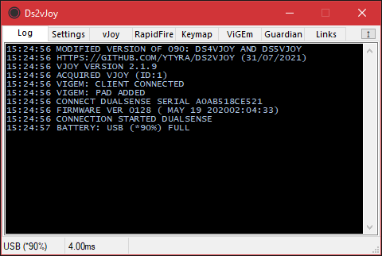

Satus is separated in 4 colums which are:
- Battery
- Delay
- Buttons pressed (in vJoy and ViGEm tabs)
- Profile (1-3)

## Settings
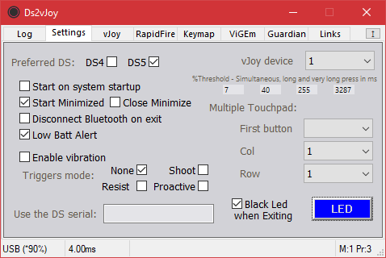

- Choose between preferred Sony® joypad, vJoy device in use
  - but for example if you chosen DS5 and only DS4 is connected this one will be in used
  - You may have to restart the program to change apply
- Usual Configurations
- Triggers mode (only works with DS5)
  - May be used only for touch pleasure
  - But in conjunction with L2, L2LOW, L2HIGH, L2FULL (same for R2),
  - you may use distinctly 2 or 3 separate actions on the same trigger
- You can specify a serial if you have multiple DS connected
  - or/and several copies of Ds2vJoy running
- You can fix threshold of sticks, and set times more accurate to your senses
  - Simultaneous is R1L1 or R2L2 the same time (with this 100ms as default delta)
- Multiple touchpad divide in multiple buttons,
  - But for more simple uses, there is a lot of special buttons (see vJoy)
- Led is calm wave fluctuating, and can color be stopped on exit

## vJoy
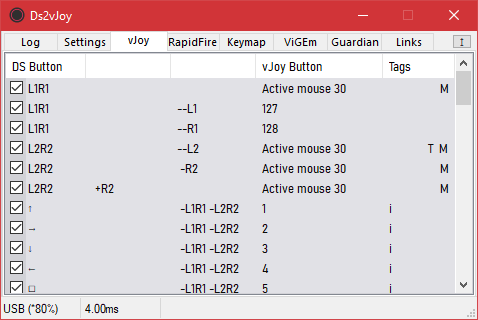

Each line correspond to a different mapping

Mappings are treated in order,
- Then you can decide for complex actions or shifts with or without the need of modes (shifted)
- For example you can use L1, and even L1R1 or more complex situations
- to determine which action square button will launch

Each tab corresponds to a drawer, in which you can organize the different mappings
- Each of these tabs are by default, like the first one, set to 'Always', but just show their numbers.
- 'Always' means that all mappings, if they are checked, will always work, just, the tabs are processed in the order of appearance
- But you can assign a mode for each of these tabs, which allows you to say that the mappings they contain will only be active in this mode
- The tabs left in the 'Always' position will remain active even if you are in another mode than the starting one: the 1 (see vJoy editing, special mouse actions, sound and modes, to know how)
- The first tab is neutral and cannot be assigned to another mode, the others (1-8) all can. There is no order to follow, and two tabs can share the same mode. On the other hand, the order of processing is also the order of the tabs

There is a dual view mode, where you can clone a tab
- For example to compare, move
- Or simply fill ViGEm with the values of vJoy in front of you
- The second window will stay opened in extended view (see Efficiency) for this purpose. You still can close it manually
- Otherwise, automatically hidden, outside extended mode, if you change tabs
- You get it back if you change again for vJoy Tab, until you manually close it

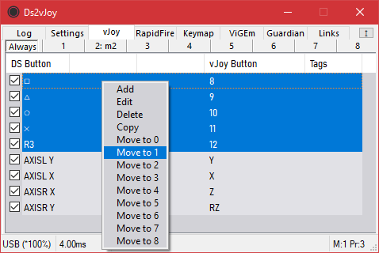

Order, add, delete, copy or edit (double click or menu) your mappings easily
Or Move them to another tab (0-8, 0 is the first, always seen as 'Always')
- Edit, delete, copy and move actions can process multiple mappings the same time
  - You can for example copy Square/Triangle/Circle/Cross and after edit all the copies the same time to add L1 as source, then you'll have L1+Square/L1+Triangle/L1+Circle/L1+Cross. After that, you'll just need to change the destination for each
  - When edit, editor is a blank one, and only touched values will be repercuted to the selection you've made before. You don't need to enter a valid DS/vJoy button
- when copy only one, it is added just after the source of the copy, if multiple ones are processed, they are all added at the end of the Tab
- Add, move a sepator, for clarity or organization, at the end or specified location
  - Cant't be edited, and does not interfere with the operation

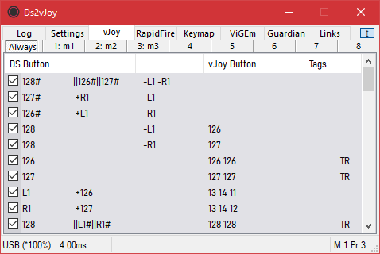

DS Button:
- First column is the principal source (see it particular function at the start of vJoy editing, and or/xor conditions)
- '+' Indicates combination (second column)
- '||' Indicates combination with or condition (second column)
  - '⊕' Indicates combination with xor condition (second column)
- '-' Indicates this mapping won't be launched if this button is pressed (see 'not' and 'pause' conditions) (third column)
  - '--' Indicates this mapping won't be launched if this button is pressed, but continue if already launched (third column)
- '#' Indicates this button will be disabled for next mappings, except if 'Force' tag is activated (all)
* Already configured vJoy buttons can be used as source, in conjunctions with DS buttons

vJoy Button:
- See a brief of what will be launched like vJoy, modes, mouse action (different from mouse)
- '#' Indicates this button will be disabled for next mappings, when this button activated, except if 'Force' tag is activated
  - '>' Indicates this button will be disabled for next mappings, until the end of the time stamps, except if 'Force' tag is activated

Tags:
Tag | Description
--- | ------------------------------------------------------------------------------
I | IfMouse condition is in use (see below)
F | Force condition is in use (see below)
S | Short press
D | Double press (can be mixed, see below)
L | Long press
C | Macro condition is in use (see below)
P | Pause condition is in use (see below)
T | Toggle condition is in use (see below)
R | An OnRelease condition is in use (see below, under time stamps)
M | If mouse will be in used (by special mouse action ACTIVE_MOUSE, and checkboxes choice, see below)
- a lowercase indicates that the checkbox is double checked for this condition

## vJoy editing
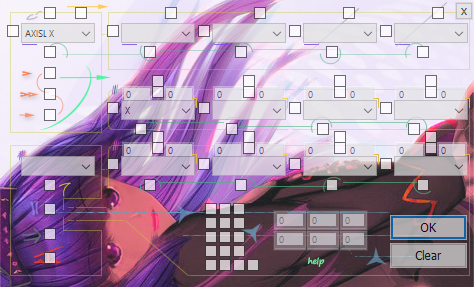

- First row is source
  - First source is the one used to calculate destination value, except if or/xor is in use (see below), then it adapt
  - A popup reminds you if the first source is not filled in, because we need it to calculate the destination value
  - You have null, half and full if you need a neutral source
- Solo is central led and battery status
  - central led is working as long as the mapping is active and doesn't react to conditions
- Eight ones are destination (together, or in a timeline)
- Group of checkboxes is for mouse choice (to use with special mouse action ACTIVE_MOUSE)
- Group of numbers is either for special mouse actions,
  - or to use mouse in a zone instead of the full screen, divided or not in a grid
  - or to use mouse in the full screen, divided

Under first source you'll find 3 checkboxes which determine the method
Checkboxes    | Method          | Description
:------------ | --------------- |:--------------------------------------------------
None          | Simple:         | Start when pressed, stop when release
First         | Short*:         | You have to press and release quickly
Second        | Double:         | You'll have to double press in a limited time
Third         | Long:           | You have to stay pressed from a certain time
1 & 2         | Double short(1):| Second press acting like short
2 & 2         | Double long:    | Second press acting like long
1 & 3         | Medium long:    | Like long but after double long
All           | Very long       | 

     (1) you'll have to use timestamp, otherwise you can simply use on release or go to timestamp too

In terms of time:
Method        | Press times
------------- | --------------------------------------------------------------------
Simple        | Immediate
Short         | found in settings
Double        | ~first press and second press < long
Long          | found in settings
Double        | ~first press and second press < long + second press duration < short
Double short* | ~first press and second press < long + second press duration > long
Medium long   | ~press > twice the time as long
Very long     | found in settings

Over first source you can find special requirements
- If mouse, if a mouse is already in use
  - double, if none mouse is actually in use
- And Force, to ignore if a button has been disabled by a precedent mapping
  - double, this will work only if this mapping is already working

Over two next sources you'll find or/xor conditions instead of simple combination
- If only first 'Or' is used and first source is killed to launch the mapping (for example, pushed more than a short press),
  and still pushed, second source is still available. But both will have to be released to be available to trigger the mapping again
- The mapping is launched over those conditions:

 OrXor1 | OrXor2 |     | Source1 |       | Source2 |       | Source3 |     |
:------:|:------:|:---:|:-------:|:-----:|:-------:|:-----:|:-------:|:---:|
   0    |   0    |     |   val   |   &   |   val   |   &   |   val   |     |
  1/2   |   0    |  (  |   val   | OrXor |   val   |  ) &  |   val   |     |
   0    |  1/2   |     |   val   |  & (  |   val   | OrXor |   val   |  )  |
  1/2   |  ...   |  (  |   val   | OrXor |   val   |   )   |         |  &  |
  ...   |  1/2   |  (  |   val   |       |         | OrXor |   val   |  )  |

- The source value used to calculate destination value is then:

 OrXor1 | OrXor2 | Source1 |     |     Released ?   |     | Source2 |     | Source3 |     | Source1 |
:------:|:------:|:-------:|:---:|:----------------:|:---:|:-------:|:---:|:-------:|:---:|:-------:|
   0    |   0    | val ? 0 |  >  |     Sustain ?    |     |         |     |         |  >  |released1|
  1/2   |   0    | val ? 0 |  >  | 0xFF : released1 |  >  | val ? 0 |     |         |  >  |released1|
   0    |  1/2   | val ? 0 |  >  |   (see Macro     |     |         |     |         |  >  |released1|
  1/2   |  1/2   | val ? 0 |  >  |    condition)    |  >  | val ? 0 |  >  | val ? 0 |  >  |released1|

Over two last sources you'll find not condition,
- The mapping won't be launched if this button is pressed
  - double, except if this mapping is already running
  - see 'Pause' for more informations about not condition
- Taking into consideration that 'LastResult' is the result of the last or/xor table, the mapping is launched over those conditions:

 Not1 | Not2 | LastResult |       | Source4 |       | Source5 |
:----:|:----:|:----------:|:-----:|:-------:|:-----:|:-------:|
  0   |  0   |    val     |   &   |   val   |   &   |   val   |
  1   |  0   |    val     | & Not |   val   |   &   |   val   |
  0   |  1   |    val     |   &   |   val   | & Not |   val   |
  1   |  1   |    val     | & Not |   val   | & Not |   val   |

Destinations can be effected with time stamps for tricky actions, macros or combos
- Enter start (if not as soon as) or/and end (of not when release)
- If you enter an odd number, 0-9 milliseconds will be added, different each time
- Middle check box, is to begin the action on release
  - double, only the up press, even if some other timestamps are finished

Under each source and destination, you'll find disabling
- this button will be disabled for next mappings if this mapping is running (except with Force)
  - double (only destination), if time stamp is in use, disabling will be effective until whole mapping is finished instead this destination only

Under central led, you'll find 3 checkboxes
- Macro: Interrupt macros on release (even if timestamp not finished)
  - double, Sustain off: we use release value of first source instead of 0xFF if timestamp is still in use and we have released sources
- Pause: pause this mapping while a not condition
  - otherwise:
    - if not is a simple, and not button is pressed, the mapping is interrupted
     - if not is a double, and not button is pressed, the mapping still continue
- Toggle: satisfy mapping conditions one time to start, second one to stop
  - double, destinations states begin activated at program launch
  - can be used to time based mouse actions too,
  - and for mouse if ACTIVE_MOUSE mouse action is used (see below)

At the left of first 4 destinations, you'll find special mouse actions, sound and modes
- ACTIVE_MOUSE: use to bring the chosen mouse
  - from the bottom group of checkboxes into the timestamp
  - and/or make it responsive to the toggle
- SAVE_POSITION: save the mouse position, each mapping save his individual 'mouse position'
- MOVE_BACK: return to saved point
- MOVE_TO_XY/MOVE_TO_WH: go to x,y/w,h (two left/central numbers of the grid)
- SAVE_AND_MOVE_TO_XY/SAVE_AND_MOVE_TO_WH: both
- LEFT_CLICK, MIDDLE_CLICK, RIGHT_CLICK, X1_CLICK, X2_CLICK, CROLL_UP, SCROLL_DOWN
- LEFT_DOUBLE_CLICK, MIDDLE_DOUBLE_CLICK, RIGHT_DOUBLE_CLICK, X1_DOUBLE_CLICK, X2_DOUBLE_CLICK, SCROLL_UP_x5, SCROLL_DOWN_x5
- LEFT_DOWN, MIDDLE_DOWN, RIGHT_DOWN, X1_DOWN, X2_DOWN
  - (long press, can use timestamp and on release)
- SCROLL_UP_VARIABLE, SCROLL_DOWN_VARIABLE
  - if on trigger, variable speed following the pressure force, otherwise exponential
  - or fixed scroll adjusted for games that don't support the number of wheel ticks signal
- MUTE_SOUND
- VOLUME_UP, VOLUME_DOWN
  - if on trigger, variable speed following the pressure force, otherwise exponential
    - Other keystrokes that do not require adaptive pressure, can easily be added using a vJoy button linked to a keymap, to which you can also add the rapidfire if you need a repeat time
- MEMORIZE_MODE: Memorize actual mode, Mappings share the same mode, but each one save his individual 'last mode'
- TO_MODE: Switch to mode 1-8
- TO_LAST_MODE: Go back to last mode, memorized when MEMORIZE_MODE used

The mouse group of checkboxes at the bottom, let you use mouse in conjuction with ACTIVE_MOUSE special action
- With left stick (left column)
- With the touchpad (central column)
- With the right stick (right column)
  - double, deactivate this mouse

There is different modes for each
- Absolute, you move at a point which correspond to the coordinates of the stick or touchpad
- Mouse, as a normal mouse with acceleration
- Move (stick) or slow (touchpad), the same but adapted for game movements, or precise mouse
- Sniper (stick) or accuracy (touchpad), extreme precision
- Raid (stick) or grid (touchpad), move inside a zone whom coordinates are entered in numbers group at the right
  - Last solo checkbox is for when you have together raid/grid and another mouse mode active, to determine which one is the default one

In this numbers group at the right
- left ones are for first points, central ones for second point,
  - Or they are for MOVE_TO_XY/MOVE_TO_WH, SAVE_AND_MOVE_TO_XY/SAVE_AND_MOVE_TO_WH special mouse actions (two left/central numbers of the grid)
- two last ones are to divide the zone in a grid, then you are always docked to a point of this grid (or whole screen)
 
A lot of buttons type has been added, for DS and for vJoy

RAW NAMES: LX, LY, RX, RY, L3, DPAD_LEFT, DPAD_UP, DPAD_RIGHT, DPAD_DOWN, SHARE, OPTIONS, SQUARE, TRIANGLE, CIRCLE, CROSS, R3, PS, TOUCH, MUTE, L1, R1, L2, R2, L2TRIGGER, R2TRIGGER, EMPTY, MIDDLE, FULL, LXINV, LYINV, RXINV, RYINV, AXISL_LEFT, AXISL_UP_LEFT, AXISL_UP, AXISL_UP_RIGHT, AXISL_RIGHT, AXISL_DOWN_RIGHT, AXISL_DOWN, AXISL_DOWN_LEFT, AXISR_LEFT, AXISR_UP_LEFT, AXISR_UP, AXISR_UP_RIGHT, AXISR_RIGHT, AXISR_DOWN_RIGHT, AXISR_DOWN, AXISR_DOWN_LEFT, TOUCHUP, TOUCHPAD, TOUCH1, TOUCH2, TOUCH3, TOUCH4, TOUCHL, TOUCHR, L2TRIGGER_33, R2TRIGGER_33, L2TRIGGER_66, R2TRIGGER_66, L2TRIGGER_100, R2TRIGGER_100, L1R1, L2R2, BATTERY
- Usual DS buttons classed by MMORPG action bar order
- Inversed Axis
- Multiple level Triggers (Normal L2 R2, Normal Triggers, ~33, 66 and 100% according to Proactive Triggers mode
- Different parts of the touchpad (all, Up, Only touch part, Left, Right and 4 corners)
- Cardinal Axis (for old games for example, instead of Dpad)
- Simultaneous presses, L1R1 L2R2 (you have a short - configurable - time to press both buttons same time, and will be released only when both will)
- Null, 50% value and full value, for your macros and tips (always on)
- Battery level

RAW NAMES: X, Y, Z, RX, RY, RZ, SL0, SL1, XTR, YTR, ZTR, RXTR, RYTR, RZTR, SL0TR, SL1TR, XINV, YINV, ZINV, RXINV, RYINV, RZINV, SL0INV, SL1INV, DPAD1_LEFT, DPAD1_UP_LEFT, DPAD1_UP, DPAD1_UP_RIGHT, DPAD1_RIGHT, DPAD1_DOWN_RIGHT, DPAD1_DOWN, DPAD1_DOWN_LEFT, DPAD2_LEFT, DPAD2_UP_LEFT, DPAD2_UP, DPAD2_UP_RIGHT, DPAD2_RIGHT, DPAD2_DOWN_RIGHT, DPAD2_DOWN, DPAD2_DOWN_LEFT, DPAD3_LEFT, DPAD3_UP_LEFT, DPAD3_UP, DPAD3_UP_RIGHT, DPAD3_RIGHT, DPAD3_DOWN_RIGHT, DPAD3_DOWN, DPAD3_DOWN_LEFT, DPAD4_LEFT, DPAD4_UP_LEFT, DPAD4_UP, DPAD4_UP_RIGHT, DPAD4_RIGHT, DPAD4_DOWN_RIGHT, DPAD4_DOWN, DPAD4_DOWN_LEFT
- Usual vJoy buttons
- Inversed Axis
- Triggered Axis (to transform lower start point to middle stability)
- Splitted Dpad, then you have unlimited capabilities instead of 1 to 1 Dpad affectation
  - Dpad use a mathematical medium function, then you can attribute other sources than normal ones
  - And instead having the result of for example Left + Up > Up Left
  - You can have it for Left + Up + UpRight + Right (which is mmm... let the program do it itself...)

An example of a simple advanced script for mouse:
```
  1st mapping: DS L2R2 + DS R2 activate right stick mouse
  2nd mapping: DS L2R2 - DS R2 activate right stick sniper
  Then as soon as you enter L2R2 your right stick is activated for mouse
    if you release only R2 you enter sniper mode,
    if you press back R2 you get again quick mouse
    until both L2 and R2 are released,
    which can therefore be used for usual actions
    (you may differ them by 100ms and add -[simple] DS L2R2)
```

An example of advanced script for targeting:
```
  1st mapping: DS L2R2 -[double] DS R2 active vJoy 128
    when you first press L2R2 nothing happen as R2 is pressed
    as soon as you release only R2, the conditions is respected, and then button 128 is pressed
    as R2 is double checked, it doesn't stop the mapping while already running,
    so until you release both L2 and R2, 128 stay pressed
    (you could even press R2 and release only L2 for other actions and come back after to only L2)
  2nd mapping: vJoy 128 + DS R2 do target forward target (you place on the button you wish)
  Do the same for the left, with button 127 and target backward target (you place on the button you wish)
    and then until you release Both L2 & R2, you can easily swap target
    and individual L2 and R2 stay free to be affected to usual actions
    (you may differ them by 100ms and add -[simple] DS L2R2)
```


Look at this third picture of vJoy section,

```
  This is an example of how enter a fictive mode when push simultaneously L1 and R1
    without using modes and the need of L1R1 special button
  Mode exit when you release both L1 and R1
  L1 and R1 special actions are not triggered first,
    they will if you have released L1 before pushed it again,
     for L1 special action, the same for R1
  You can swap between both, as long as you don't release both buttons together
  An example of utilization: L1 and R1 are shifted keys
    for example they add shift, control, and control shift together to other buttons
     or simply act as L1 + Cross, L1 + L2 + Triangle etc.
    when pushed together, you usually never release one and pushed it again, without releasing the other
    also, you can add the possibility to add two actions, to L1 and R1,
     For example, target previous/next enemy
  By using mode there is more simple methods
```

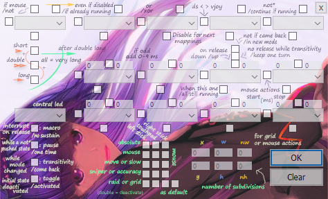

You can find this help directly in Ds2vJoy by pressing help below grid entries

## RapidFire


You can set repeated hits with the assigned vJoy button

Order, add, delete, copy or edit (double click or menu)
- Edit, delete, copy and move actions can process multiple rapid fires the same time
  - When edit, editor is a blank one, and only touched values will be repercuted to the selection you've made before. You don't need to enter a valid vJoy button
- when copy only one, it is added just after the source of the copy, if multiple ones are processed, they are all added at the end of the Tab
- Add, move a sepator, for clarity or organization, at the end or specified location
  - Cant't be edited, and does not interfere with the operation

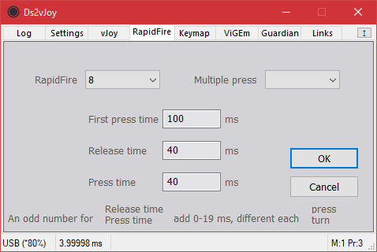

After the first time has passed, release and press repeatedly
- If you specify the simultaneous press condition, you can also enable repeated hits (of the D-pad keys or □ △ × ○ for example), only when another (L1 or R1 for example) is pressed
- If you enter an odd number for 'Release time', 0-19 milliseconds will be added, different each press
- If you enter an odd number for 'Press time', 0-19 milliseconds will be added, different each turn

## Keymap
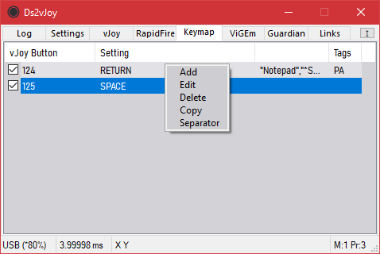

You can send a keydown when the button is pressed and a keyup when it is released

Order, add, delete, copy or edit (double click or menu)
- Edit, delete, copy and move actions can process multiple keymaps the same time
  - When edit, editor is a blank one, and only touched values will be repercuted to the selection you've made before. You don't need to enter a valid vJoy button
- when copy only one, it is added just after the source of the copy, if multiple ones are processed, they are all added at the end of the Tab
- Add, move a sepator, for clarity or organization, at the end or specified location
  - Cant't be edited, and does not interfere with the operation

Tags:
Tag   | Description
----- | ------------------------------------------------------------------------------
Empty | Nothing is checked
P      | \'Send to' is checked
 A    | \'By Postmessage / activation window' is checked

Tags  | In practice
----- | ------------------------------------------------------------------------------
Empty | The keys will be sent to your actual focus
P     | It will use Postmessage to send keys to specified process
PA    | It will activate window of the specified process before
 A    | Act like if nothing were checked, the keys will be sent to your actual focus

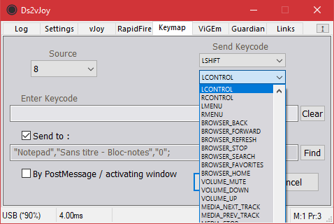

- You can enter directly keys in the Enter Keycode part, or use Send Keycode choices (for advanced use)
- Send to, permit you to specify the process, and will ungrey (disabled)Find button
- If you check last checkbox, this will activate the window first (if post method is unsupported)

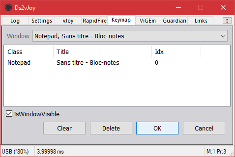

You will find.

## ViGEm
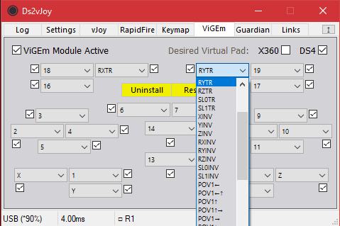

Install, remove and use @nefarius &co ViGEm separately or jointly to vJoy
- Then you can have a fully remapped DS4 or X360
- Or a simple copy of DS4/DS5 to X360, to simplify compatibility problems
- Checkboxes are made to swap between DS or vJoy as source individually for each button

If you plan to use ViGEm X360 with vJoy as source, remember to change in the vJoy Tab sample:
- AXISL Y: Y > YINV
- AXISR Y: RZ > RZINV

## Guardian
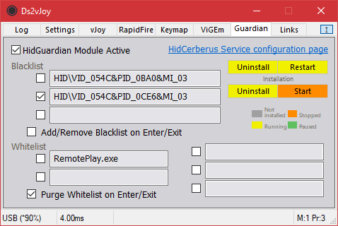

Install, remove and use @nefarius &co HidGuardian and HidCerberus (and stop/start this service)
- A restart may be necessary after installing Guardian to have it properly running
- You can find link to manual configuration of Cerberus,
- In which you can verify the HID\ to enter in the blacklist section
- Then you can hide your DS4/DS5 and let see only the remapped DS4/X360 or vJoy to the system
- Whitelist section, bypass the guardian for programs you need to achieve this

## Links
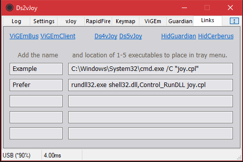

You'll find source of inspiration for this project

And you can enter from 1 to 5 programs name and location which can be launched after that through systray menu

## Tray


Picture talk by itself

## Efficiency
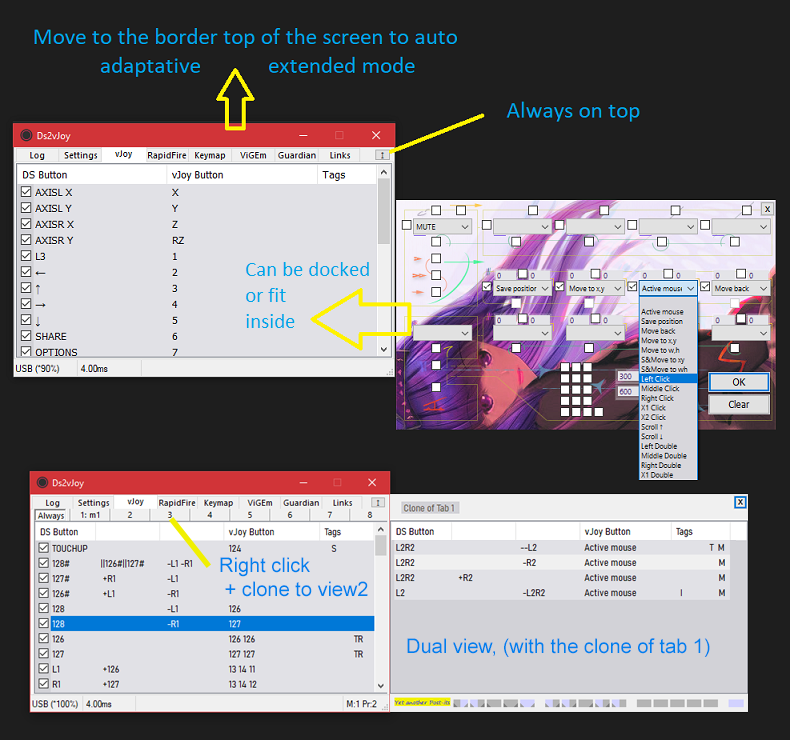

There is no resize but some other stuff

On bottom right, you can see a Reminder to remember dispatch of attributed buttons
- You can use it as you wish, it is saved as soon as you change a state, and you get it back next session 
- Corner indicator automatically indicates all vJoy buttons (1-32) used in all mappings

## Thanks
* https://github.com/090 (a lot)
* https://sourceforge.net/projects/vjoystick
* https://github.com/ViGEm/ViGEmBus
* https://github.com/ViGEm/ViGEmClient
* https://github.com/ViGEm/HidGuardian
* https://github.com/ViGEm/HidCerberus
* https://github.com/Jays2Kings/DS4Windows
* https://www.inputmapper.com
* http://www.wischik.com/lu/programmer/zip_utils.html
* https://github.com/stbrumme/crc32
* https://notepad-plus-plus.org
* http://www.planetpointy.co.uk/joystick-test-application
* https://github.com/microsoft/Windows-driver-samples/tree/master/setup/devcon

## Development environment
- Win10 64bit + Visual Studio 2019 (Community is fine)
- Sony® DualShock™ and DualSense™
- Intel® Wireless Bluetooth from Asus ROG
