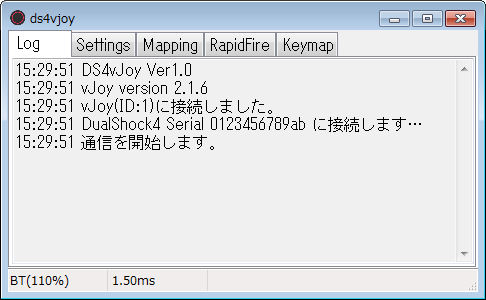
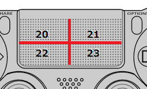
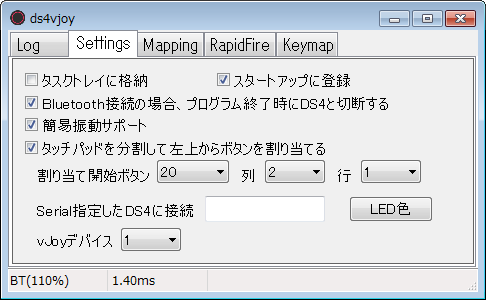
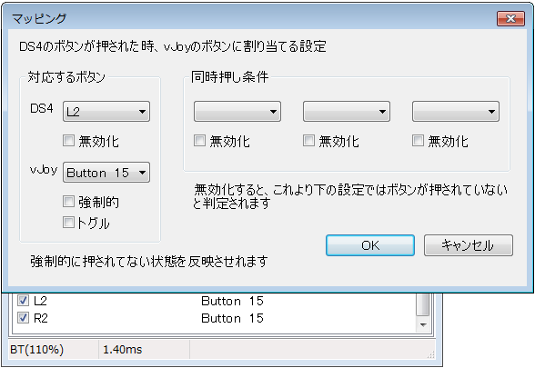
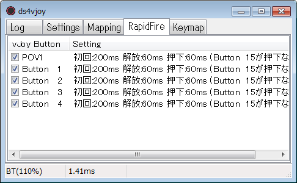
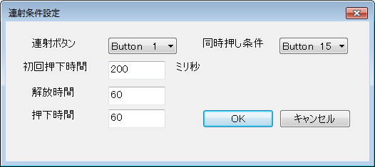
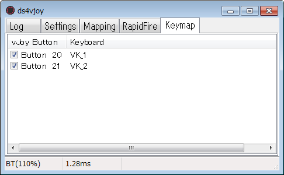
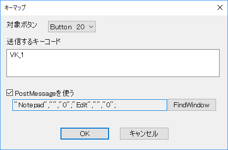
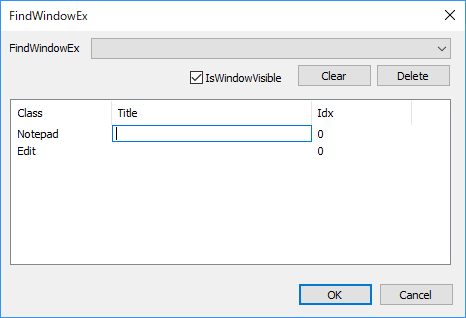

# DS5vJoy
DualSense to vJoy for Windows

## これなに
仮想ジョイスティックのvJoyを経由することでDualSenseを簡単に使えます。  
DS4vJoyを適当にDualSenseに対応させました。  

- 日本語対応！英語対応！
- 振動対応！
- 連射対応！
- タッチパッド分割対応！
- キーボード入力対応！(SendInput、PostMessage)
- Bluetooth対応！
- モーションセンサー非対応
- アダプティブトリガー非対応
- 内蔵マイク・スピーカー非対応

## つかいかた
1. [vJoy 2.1.9](https://sourceforge.net/projects/vjoystick/)をインストールします。  
2. Configure vJoyを開いてButtonsを128にPOVを1に選択してください。  
Axes、Enable Effectsなども全てチェックを入れておいてください。PC再起動になるかもしれません。  
3. DS5vJoy.exeを起動します。  
4. PCとDualSenseをUSBやBluetoothで接続します。  
5. ゲームなどから、ゲームパッドとしてvJoyを選ぶと、DualSenseの操作が反映されます。

## メリット
- ゲーム起動後にDualSenseを接続しても大丈夫です。 ゲームにはvJoyが常に見えています。
- タッチパッドを2列2行に分割すると、４つのボタンを割り当てられます。  
  
Monitor vJoyを起動すれば、どのボタンが押されているか確認できます。
- Mapping DualSenseのボタンとvJoyのボタンは自由に関連付けできます。128ボタンまでDualSenseからの入力が複数作れます。
- RapidFire 連射機能が使えます。
- Keymap ゲームで使わないボタンをキー入力として活用できます。

## デメリット
- PCにvJoyをインストールしないと使えません。

## スクリーンショット
- 
- タッチパッドの左側をクリックするとボタン20、右側はボタン21が有効になります。  
Serialを指定すると、たぶんDualSenseが複数あっても特定できますが、テストしていません。  
vJoyデバイスは15個まで選択できますが、実用的なのはたぶん1だけです。それ以外はテストしていません。
- 
- マッピングでDualSenseのボタンをvJoyのボタンに割り当てる設定をします。
例えばL2やR2が押された場合ボタン15を有効にします。  
強制的 - L2Triggerやスティックなど、触れていない状態にも意味のある時にだけ使います。  
トグル - on/offスイッチのように押し続けている状態が作れます。
- 
- 割り当てたvJoyのボタンで連打を設定できます。  
初回時間経過後、解放と押下を繰り返します。  
同時押し条件を指定すると、たとえばL2やR2が押されている場合のみ、十字キーと□△×○の連打を有効にすることもできます。
- 
- ボタンが押されたらキーダウンを、離されたらキーアップを送信できます。
- 
- 特定プロセスの特定場所にPostMessageで送信することもできます。
## 予定
- バッテリー低下の時の警告

## Thanks DualSense
- https://github.com/Ryochan7/DS4Windows/issues/1545
- https://www.reddit.com/r/gamedev/comments/jumvi5/dualsense_haptics_leds_and_more_hid_output_report/
## Thanks DS4
- DS4Windows https://github.com/Jays2Kings/DS4Windows
- http://eleccelerator.com/wiki/index.php?title=DualShock_4
- http://mclab.uunyan.com/lab/ds4/ds4_005.htm

## 開発環境
- Win10 64bit + Visual Studio 2019
- DualSense CFI-ZCT1J
- DUALSHOCK®4 CUH-ZCT1J01、CUH-ZCT2J
- IO-DATA USB-BT40LE