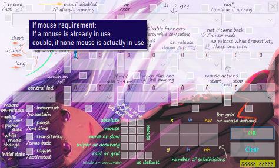
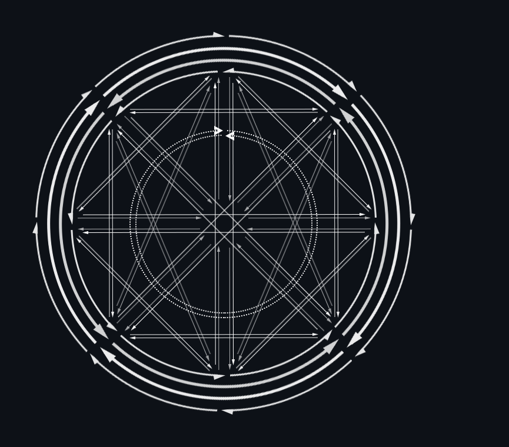

Please consider supporting the project by clicking [](https://github.com/sponsors/00fox)
- Influence future choices
- Or propose your own and give them importance
- You will find a list of pending requests in the issues, take a look...

Thanks

**Opened Issues, please report bugs, problems**
- Report them to issues@00fox.com, I'll publish them in 'Issues'

# Ds2vJoy
DualShock™ and DualSense™, DirectInput or XInput to DirectOutput or XOutput for Windows 64 bits

You can combine one or more of these options, no one is required:
- DualShock™ and DualSense™, DirectInput or XInput as source
  - Mixing of two different DirectInput sources allowed
  - Bluetooth compatible
  - A lot of buttons added (individual axes, L1R1 the same time etc)
- Keyboard and mouse as source and destination
- DirectOutput (via vJoy) as source and destination
  - Build-in vJoy installation and configuration
- XOutput (playstation or xbox XInput emulation via viGEm, Build-in installation) as destination
- Guardian (via HidGuardian & HidCerberus, Build-in installations) to let the game only see the needed destination

Program is portable, build-in installations are driver only, no more stuff is installed

Content:
- Practical Sisaxis intregration for DualShock™ and DualSense™
- Combinations, Modes (known as shifted), Macros, and Time based operations allowed
- All logical arithmetic, you can register multiple operations executed in order, one line, one full mapping
  - multiple sources to activate one is possible, with and, or, xor and not
  - triggers added like if mouse activated, onRelease, disabled, even if disabled...
- Several logical operations, like Toggle, Switch, Transitivity, Sustain, Pause
- Control complex mouse operations, Sniper, Navigate in a grid when needed...
- Control axis movements, 170 different movements can be done, fused, protected (OverControl)
- Special actions, mouse, sound, modes, windows, stats, time
- Modules actions, Web and Notepad
  - Microsoft Edge WebView2 for internet, local files, with automation, stay overgame
  - Simple notepad, rapid access, autosave
  - They can stay over your desktop or game, borders disappear automatically when mouseout
- Import/Export, the share your .ds2 templates files easily without altering whole program
- Multiple efficiency, like docking, insight, transparency, automatic full height, minimize & restore

## How to use
1. Launch Ds2vJoy.exe, no installation is required
   * an .ini file will be created, to save parameters, with some examples already filled

2. If first time install drivers you need, vJoy, ViGem, Guardian under XOutput & Guardian Tabs
   * real quick, drivers only, you can remove them after use if you wish

3. Connect your DS4/DS5 or any other Joystick, or two via USB or Bluetooth
   * or simply skip to use only keyboard and mouse

4. Choose your sources under Settings Tab

5. Configure as you wish (you have 3 profiles accessible by the system tray)

- It is okay to connect DS4 after starting the game. VJoy and ViGEm are always visible in the game
- When you change a setting, Ds2vJoy.ini is automatically and instantly saved
- Ds2vJoy is portable, you can use multiple copy in different directories with different parameters
- Included Installation for vJoy, ViGEm, HidGuardian and HidCerberus use subdirectories of C:\Program Files\Ds2vJoy
   * removed as soon as you chose to uninstall them from Ds2vJoy menu tabs,
   * the same for C:\Program Files\Ds2vJoy itself when no required anymore.

## Log


Satus is separated in 4 colums which are:
- Battery
  - USB usb or BT bluetooth or Active with unsuported DirectInput mode
  - + while on charge
  - Low batt alert when 0 (between 0% and up to 15% depending on the joystick and the circumstances)
- Delay
  - an Asterisk near time unit, indicate that Magnification is active
- Diverse informations, change with the module page:
  - Log: Date Time UTC Day Week
  - Settings: Show color under cursor
  - Mappings: You can see which button is pressed
  - RapidFire: Source button if one is in use
  - ViGEm: Remapped buttons actually activated
  - Keymap: Source button if one is launched
  - Guardian: PIDs allowed to see hidden joysticks
  - Links: Version of Ds2vJoy
- Mode (1-8), Stance(1-4), and Profile (1-3)
  - Stance 1 is Back
  - Stance 2 is Leaned
  - Stance 3 is Leaned+Sat
  - Stance 4 is Sat
  - Stance 5 is Leaning

## Settings


- Emergency with escape: if something goes wrong, stay pushed on ESC for more than two seconds, and program will stop to interprete and doing actions as long you push it

- Choose between preferred Sony® joypad, DirectInput or XInput, vJoy device in use
- Choose if you want keyboard, mouse or both as source (use more ressources)
- 'Shutdown vJoy' will disable vJoy driver aftre exiting, it will be reactivated next time or open the program, if you intend to use it, after choosing it in the XOutput tab
- Usual Configurations
  - Mouse bypass screen dimensions is when you activate mouse to be used with in mappings and move it, mouse can bypass principal screen limits, be on a second monitor etc., or not, and stay inside
  - There is special actions to inverse temporary this choice if you let it unchecked
- Triggers mode (only works with DS5)
  - May be used only for touch pleasure
  - But in conjunction with L2, L2LOW, L2HIGH, L2FULL (same for R2),
  - you may use distinctly 2 or 3 separate actions on the same trigger
- You can specify a serial if you have multiple DS connected
  - or/and several copies of Ds2vJoy running
- You can specify (reload list and clear) one or two DirectInput Device to use in a single template, if none, prefered joystick will be use
  - second source will be activated only if first source has been chosen, then you can combine two or separated joysticks in one to us ewith the program
  - the template can be edited by clicking on 'Di Device'
  - even if you need only one pad as soure, it help to use special features calculated for DS5, like two buttons simultaneously
  - to do that the program need to know which ones of your pad are which ones of DS5
  - You can save multiple templates, and laod them between modes, and each mode use his own template, so you take adventage of both systems
- You can fix threshold of sticks, and set times more accurate to your senses
  - threshold value for axis accept a number between 0 and 128, default 8
  - values of the axis are proportional to the threshold, so the grip remains soft rather than starting abruptly, even with high threshold values
  - Simultaneous is R1L1 or R2L2 the same time (with this 40ms as default delta)
- You can set the opacity percent while transparency is activated (right click on caption bar)
- Multiple touchpad divide in multiple buttons,
  - But for more simple uses, there is a lot of special buttons (see Mapping)
- Led is calm wave fluctuating, you can modify the frequency, and color can be stopped on exit

## Mapping


Each line correspond to a different mapping

Mappings are treated in order,
- Then you can decide for complex actions or shifts with or without the need of modes (shifted)
- For example you can use L1, and even L1R1 or more complex situations
- to determine which action square button will launch

Each tab corresponds to a drawer, in which you can organize the different mappings
- Each of these tabs are by default, like the first one, set to 'Always', but just show their numbers.
- 'Always' means that all mappings, if they are checked, will always work, just, the tabs are processed in the order of appearance
- But you can assign a mode for each of these tabs, which allows you to say that the mappings they contain will only be active in this mode
- For this, just right click on the tab
- The tabs left in the 'Always' position will remain active even if you are in another mode than the starting one (1) (see Special mouse actions to know how)
- The first tab is neutral and cannot be assigned to another mode, the others (1-8) all can. There is no order to follow, and two tabs can share the same mode. On the other hand, the order of processing is also the order of the tabs

There is a dual view mode, where you can clone a tab
- For example to compare, move
- Or simply fill ViGEm with the values of mapping in front of you
- The second window will stay opened in extended view (see Efficiency) for this purpose. You still can close it manually
- Otherwise, automatically hidden, outside extended mode, if you change tabs
- You get it back if you change again for Mapping Tab, until you manually close it


By right-clicking on elements of the list, you can:
- Order, add, delete, disable, copy or edit (double click or right click menu) your mappings easily
- Or Move them to another tab (0-8, 0 is the first, always seen as 'Always')

Two different views exist (will be modified in futur to see both the same time inside a larger window)
- Each source, destination, tags
- Each source, notice
- Swap between them by right clicking on the list and choosing 'Swap view' in the menu that will pop

Edit, delete, disable, copy and move actions can process multiple mappings the same time
- You can for example copy Square/Triangle/Circle/Cross bloc, move the copies in another mode and after alter their actions individually
- When editing, editor is a blank one, and only touched values will be repercuted to the selection you've made before. You don't need to enter a valid DS/vJoy button

When copy only one, it is added just after the source of the copy, if multiple ones are processed, they are all added at the end of the Tab

Add, move a sepator, for clarity or organization, at the end or specified location
- Cant't be edited, and does not interfere with the operation


Source Button:
- First column is the principal source (see it particular function at the start of Mapping editing, and or/xor conditions)
- '+' Indicates combination (columns 2,3,4,5)
- '||' Indicates combination with or condition (second and third columns)
  - '⊕' Indicates combination with xor condition (second and third columns)
- '-' Indicates this mapping won't be launched if this button is pressed (see 'not' and 'pause' conditions) (third and fourth columns)
  - '=' Indicates this mapping won't be launched if this button is pressed, but continue if already launched (third and fourth columns)
- '#' Indicates this button will be disabled for next mappings, except if 'Force' tag is activated (all)
  - '✱' Even if Short (or Double), while release time, before time to activate spent (or second press)
- Purple indicates simple disable, blue indictates double disable, grey indicates inactive mapping
* Already configured vJoy buttons can be used as source, in conjunctions with DS buttons

Destination Button:
- See a brief of what will be launched like vJoy, modes, special actions
- You don't need vJoy installed, if not, buttons are virtual, but usefull for remapping etc, if yes, they match vJoy selected device number
- '#' Indicates this button will be disabled for next mappings, when this button activated, except if 'Force' tag is activated
  - '>' Indicates this button will be disabled for next mappings, until the end of the time stamps, except if 'Force' tag is activated
- '✓' Indicates this button will be switched on, as long as it is not swithed off again, or toggled
  - '✕' Indicates this button will be switched off, as long as it is not swithed on, or toggled

Tags:
| Tag | Description
|:--- |:------------------------------------------------------------------------------
|  I  | IfMouse condition is in use (see If mouse/Force)
|  F  | Force condition is in use (see If mouse/Force)
|  S  | Short press
|  D  | Double press (can be mixed, see Input method)
|  L  | Long press
|  C  | Interrupt condition is in use (see Controls)
| 12B | Pause condition is in use (see Controls)
| ►YR | Transitivity condition is in use (see Controls and Transitivity)
|  T  | Toggle condition is in use (see Controls)
| RZW | An OnRelease (/+NoRelease/+NlRelease) condition is in use (see OnRelease)
|  M  | If mouse will be in used (checkboxes choice, mouse actions are in Mapping Button) (see If Mouse actions and Grid)
- a lowercase indicates that the checkbox is double checked for this condition

## Mapping editing


- First row is source
  - First source is the one used to calculate destination value, except if or/xor is in use (see below), then it adapt
  - A popup reminds you if the first source is not filled in, because we need it to calculate the destination value
  - You have null, half and full if you need a neutral source
- Solo is central led and battery status
  - central led is working as long as the mapping is active and doesn't react to conditions
- Eight ones are destination (together, or in a timeline)
- Group of checkboxes is for mouse choice (to use with special action ACTIVE_MOUSE)
- Group of numbers, Grid, is either for special actions,
  - or to use mouse in a zone instead of the full screen, divided or not in a grid
  - or to use mouse in the full screen, divided
- Two digits in the lower right corner are the mouse coordinates (see Efficiency)
- At the right of button OK, it's relaod, window pop again
  - After validating an edition of a single mapping, to make some different quick tests, with same datas
  - After adding a new mapping, to directly add a new one, with fresh datas

______________________________________________________________________________________ Input method

Under first source you'll find 3 checkboxes which determine the method
| Checkboxes    | Method          | Description
|:------------- |:--------------- |:--------------------------------------------------
| None          | Simple          | Start when pressed, stop when release
| First         | Short(1)        | You have to press and release quickly
| Second        | Double          | You'll have to double press in a limited time
| Third         | Long            | You have to stay pressed from a certain time
| 1 & 2         | Double short(1) | Second press acting like short
| 2 & 3         | Double long     | Second press acting like long
| 1 & 3         | Medium long     | Like long but after double long
| All           | Very long       | 

     (1) you'll have to use timestamp, otherwise you can simply use on release or go to timestamp too

In terms of time:
| Method        | Press times
|:------------- |:--------------------------------------------------------------------
| Simple        | Immediate
| Short         | found in settings
| Double        | ~first press and second press < long
| Long          | found in settings
| Double        | ~first press and second press < long + second press duration < short
| Double short* | ~first press and second press < long + second press duration > long
| Medium long   | ~press > twice the time as long
| Very long     | found in settings
 
______________________________________________________________________________________ Source Buttons

A lot of buttons type has been added, for DS, DirectInput, XInput and for vJoy

RAW NAMES: LX, LY, RX, RY, L3, DPAD_LEFT, DPAD_UP, DPAD_RIGHT, DPAD_DOWN, SHARE, OPTIONS, SQUARE, TRIANGLE, CIRCLE, CROSS, R3, PS, TOUCH, MUTE, L1, R1, L2, R2, L2_TRIGGER, R2_TRIGGER
- Usual DS buttons classed by MMORPG action bar order

RAW NAMES: LX_INV, LY_INV, RX_INV, RY_INV
- Inversed Axis

RAW NAMES: LX_SNIPER, LY_SNIPER, RX_SNIPER, RY_SNIPER
- Sniper Axis, which works the same except the threshold is minimal, then you can have near no threshold some times and keep normal axis with the threshold you defined for usual situations

RAW NAMES: AXISL_TR_LEFT, AXISL_TR_UP, AXISL_TR_RIGHT, AXISL_TR_DOWN, AXISR_TR_LEFT, AXISR_TR_UP, AXISR_TR_RIGHT, AXISR_TR_DOWN
- Trigger Axis, each axis is split into two full trigger, four by stick, you can use them individually on a button or an trigger, or together on the same, so for example left or right isn't important at all

RAW NAMES: AXISL_LEFT, AXISL_UP_LEFT, AXISL_UP, AXISL_UP_RIGHT, AXISL_RIGHT, AXISL_DOWN_RIGHT, AXISL_DOWN, AXISL_DOWN_LEFT, AXISR_LEFT, AXISR_UP_LEFT, AXISR_UP, AXISR_UP_RIGHT, AXISR_RIGHT, AXISR_DOWN_RIGHT, AXISR_DOWN, AXISR_DOWN_LEFT
- Cardinal Axis (for old games for example, instead of Dpad)

RAW NAMES: TOUCHUP, TOUCHPAD, TOUCH1, TOUCH2, TOUCH3, TOUCH4, TOUCHL, TOUCHR
- Different parts of the touchpad (all, Up, Only touch part, Left, Right and 4 corners)

RAW NAMES: L2_TRIGGER_33, R2_TRIGGER_33, L2_TRIGGER_66, R2_TRIGGER_66, L2_TRIGGER_100, R2_TRIGGER_100
- Multiple level Triggers (Normal L2 R2, Normal Triggers, ~33, 66 and 100% according to Proactive Triggers mode

RAW NAMES: L1R1, L2R2
- Simultaneous presses, L1R1 L2R2 (you have a short - configurable - time to press both buttons same time, and will be released only when both will)

RAW NAMES: EMPTY, MIDDLE, FULL, QUARTER1, QUARTER2, THIRD1, THIRD2, TEN, TWENTY, THIRTY, FORTY, SIXTY, SEVENTY, EIGHTY, NINETY
- Null 0%, middle 50% and full 100% value, and more for your macros and tips (always on)

RAW NAMES: BATTERY, BATTERY0, BATTERY1, BATTERY2, BATTERY3, BATTERY4, BATTERY5, BATTERY6, BATTERY7, BATTERY8, BATTERY9
- Battery levels

RAW NAMES: USB, EARS, MIC
usb plugged in, earphones, microphone active

RAW NAMES: FINGER, FINGERS
- One or two fingers on touchpad

RAW NAMES: DS_SELECTED, DS4_SELECTED, DS5_SELECTED, DI_SELECTED
- If a source is selected in settings

RAW NAMES: DI_ACTIVE, KBD_ACTIVE, MSE_ACTIVE, MSE_DI_ACTIVE
- If a source is in activity

RAW NAMES: INACTIVITY_5MN, INACTIVITY_10MN, INACTIVITY_15MN, INACTIVITY_30MN
- Inactivity for a period of time (buttons and dpads)

RAW NAMES: NO_MOVEMENT_5MN, NO_MOVEMENT_10MN, NO_MOVEMENT_15MN, NO_MOVEMENT_30MN
- Bo move for a period of time (3 accelerometers axis)

______________________________________________________________________________________ Source Buttons DirectInput
- Additional DirectInput Axis
- Inversed Axis
- Triggers

RAW NAMES: SLO, SLO_INV, SLO_SNIPER, SL1, SL1_INV, SL1_SNIPER
- SLO and SL1 act the same as LX, LY, RX, RY. They are linked by couple (circular threshold)
  - It apply too, to some fonctionalities as Overcontrol and Protect (see Overcontrol)
    
RAW NAMES: DI_X, DI_X_INV, DI_X_TRIGGER
RAW NAMES: DI_Y, DI_Y_INV, DI_Y_TRIGGER
RAW NAMES: DI_Z, DI_Z_INV, DI_Z_TRIGGER
RAW NAMES: DI_RX, DI_RX_INV, DI_RX_TRIGGER
RAW NAMES: DI_RY, DI_RY_INV, DI_RY_TRIGGER
RAW NAMES: DI_RZ, DI_RZ_INV, DI_RZ_TRIGGER
RAW NAMES: DI_SL0, DI_SL0_INV, DI_SL0_TRIGGER
RAW NAMES: DI_SL1, DI_SL1_INV, DI_SL1_TRIGGER
- DI_X, DI_Y, DI_Z, DI_RX, DI_RY, DI_RZ, DI_SL0, DI_SL1 aren't, they have individual threshold
  - But they still can use Overcontrol fonctionalities

RAW NAMES: DPAD2_LEFT, DPAD2_UP, DPAD2_RIGHT, DPAD2_DOWN, DPAD2_LEFT, DPAD3_UP, DPAD3_RIGHT, DPAD3_DOWN, DPAD3_LEFT, DPAD4_UP, DPAD4_RIGHT, DPAD4_DOWN, DPAD4_LEFT
- Three additional splitted DPAD

RAW NAMES: BUTTON16-32
- And Buttons up to 32 (DS buttons corresponds to 1 to 15, mute is 15)

______________________________________________________________________________________ Velocity & Gyrocompass Buttons

RAW NAMES: SISAXIS_STANCE, SISAXIS_ZONE, SISAXIS_STANCE1, SISAXIS_STANCE2, SISAXIS_STANCE3, SISAXIS_STANCE4, SISAXIS_STANCE5, SISAXIS_ZONE1, SISAXIS_ZONE2, SISAXIS_ZONE3, SISAXIS_ZONE4, SISAXIS_ZONE5
- Axis with visual Stance and Zone  (actual position)
- Each individual buttons for both

Some buttons are stance dependant, most are not
For those which are, you can set you're actual stance by destination actions:
- CHANGE_POSITION, STANCE1, STANCE2, STANCE3, STANCE4, STANCE5:

STANCE1 is Back....... and use Position Zone1.. = back, bottom.. named ZONE1
STANCE2 is Leaned..... and use Position Zone2.. = back, top..... named ZONE2
STANCE3 is Leaned+Sat. and use Position Zone1&2 = all top....... named ZONE3
STANCE4 is Sat........ and use Position Zone3.. = front, top.... named ZONE4
STANCE5 is Leaning.... and use Position Zone4.. = front, bottom. named ZONE5
The actual Stance is visible on the top of the tray icon and at the right of status bar, and with those buttons

In any cases, Stance and Zone (actual position) are some ways dependant and independant
For example,
- Quarter give tou an axis, from 0 if the joystick is near you, and full if you have it away from you or lowered (even on back)
- If you're sat,
  - and the position is zone 3 (associated with sat) your movements will correspond to evolve the Quarter axis from minimum to maximum
  - and the position is zone 4 (which is normally associated to Leaning), the axis will still works, but stay at its maximum, all along the zone

RAW NAMES: SISAXIS_ROLL, SISAXIS_ROLL_TRIGGER, SISAXIS_ROLL_CENTER, SISAXIS_LEFT1, SISAXIS_LEFT2, SISAXIS_LEFT3, SISAXIS_LEFT4, SISAXIS_LEFT5, SISAXIS_LEFT6, SISAXIS_LEFT7, SISAXIS_RIGHT, SISAXIS_RIGHT1, SISAXIS_RIGHT2, SISAXIS_RIGHT3, SISAXIS_RIGHT4, SISAXIS_RIGHT5, SISAXIS_RIGHT6, SISAXIS_RIGHT7
Roll is moving clockwise/Anticlockwise the axis starting from the earphones port to the usb port
So, the movement consists in holding the joystick by one side, and rotating this side on its axis
It's a velocity, so its strength depends on how much acceleration you give to the movement
- Axis and Trigger
- Button When it's centered
- Button When it's right
- Each forces for both rotation senses (Left/Right) 1to6 + tilt

RAW NAMES: SISAXIS_YAW, SISAXIS_YAW_TRIGGER, SISAXIS_YAW_CENTER, SISAXIS_ANTI1, SISAXIS_ANTI2, SISAXIS_ANTI3, SISAXIS_ANTI4, SISAXIS_ANTI5, SISAXIS_ANTI6, SISAXIS_ANTI7, SISAXIS_CLOCK, SISAXIS_CLOCK1, SISAXIS_CLOCK2, SISAXIS_CLOCK3, SISAXIS_CLOCK4, SISAXIS_CLOCK5, SISAXIS_CLOCK6, SISAXIS_CLOCK7
Yaw is moving clockwise/Anticlockwise the axis starting from the microphone holes to the back of the joystick
So, the movement is like holding the joystick from above, between the headphone port and the usb port and rotating it like the hands of a clock seen from above
It works too if you have the joystick in only one hand, and you do a circular movement of the arm, staying alomost horizontal 
It's a velocity, so its strength depends on how much acceleration you give to the movement
- Axis and Trigger
- Button When it's centered
- Button When it's clockwise
- Each forces for both rotation senses (Anti/Clock) 1to6 + tilt

RAW NAMES: SISAXIS_PITCH, SISAXIS_PITCH_TRIGGER, SISAXIS_PITCH_CENTER, SISAXIS_REAR1, SISAXIS_REAR2, SISAXIS_REAR3, SISAXIS_REAR4, SISAXIS_REAR5, SISAXIS_REAR6, SISAXIS_REAR7, SISAXIS_FORE, SISAXIS_FORE1, SISAXIS_FORE2, SISAXIS_FORE3, SISAXIS_FORE4, SISAXIS_FORE5, SISAXIS_FORE6, SISAXIS_FORE7
Pitch is moving clockwise/Anticlockwise the axis starting from the Dpad buttons to the four right buttons
So, the movement is from you to in front of you, circularly, and reverse
It's a velocity, so its strength depends on how much acceleration you give to the movement
- Axis and Trigger
- Button When it's centered
- Button When it's fore
- Each forces for both rotation senses (Rear/Fore) 1to6 + tilt

RAW NAMES: SISAXIS_SIDEWARD, SISAXIS_SIDEWARD_TRIGGER, SISAXIS_SIDEWARD_CENTER, SISAXIS_WEST1, SISAXIS_WEST2, SISAXIS_WEST3, SISAXIS_WEST4, SISAXIS_WEST5, SISAXIS_WEST6, SISAXIS_EAST, SISAXIS_EAST1, SISAXIS_EAST2, SISAXIS_EAST3, SISAXIS_EAST4, SISAXIS_EAST5, SISAXIS_EAST6
Sideward is moving the joystick like wings near the horizon or as a starship inclination while nearly vertical
It's a gyrocompass value, so its strength should be independent of how much acceleration you give the movement, but it had, which was reduced by buffering the values
- Axis and Trigger
- Button When it's centered
- Button When it's east
- Each forces for both directional senses (West/East) 1to6

RAW NAMES: SISAXIS_TOWARD, SISAXIS_TOWARD_TRIGGER, SISAXIS_TOWARD_CENTER, SISAXIS_BACKWARD1, SISAXIS_BACKWARD2, SISAXIS_BACKWARD3, SISAXIS_BACKWARD4, SISAXIS_BACKWARD5, SISAXIS_BACKWARD6, SISAXIS_FORWARD, SISAXIS_FORWARD1, SISAXIS_FORWARD2, SISAXIS_FORWARD3, SISAXIS_FORWARD4, SISAXIS_FORWARD5, SISAXIS_FORWARD6
Toward is moving the joystick as if you wanted to go forward, or backward. But by inclinating it, because there isn't any magnetic compass or reference point
It's a gyrocompass value, so its strength should be independent of how much acceleration you give the movement, but it had, which was reduced by buffering the values
- Axis and Trigger
- Button When it's centered
- Button When it's forward
- Each forces for both directional senses (Backward/Forward) 1to6

RAW NAMES: SISAXIS_LEVEL, SISAXIS_LEVEL_TRIGGER, SISAXIS_LEVEL_CENTER, SISAXIS_SOUTH1, SISAXIS_SOUTH2, SISAXIS_SOUTH3, SISAXIS_SOUTH4, SISAXIS_SOUTH5, SISAXIS_SOUTH6, SISAXIS_NORTH, SISAXIS_NORTH1, SISAXIS_NORTH2, SISAXIS_NORTH3, SISAXIS_NORTH4, SISAXIS_NORTH5, SISAXIS_NORTH6
Level is moving the joystick to the ground or sky, or inclinating it like anakin podracer nose up and down
It's a gyrocompass value, so its strength should be independent of how much acceleration you give the movement, but it had, which was reduced by buffering the values
- Axis and Trigger
- Button When it's centered
- Button When it's north
- Each forces for both directional senses (South/North) 1to6

RAW NAMES: SISAXIS_WHEEL, SISAXIS_QUARTER, SISAXIS_GEAR_REAR, SISAXIS_GEAR_1, SISAXIS_GEAR_2, SISAXIS_GEAR_3, SISAXIS_GEAR_4, SISAXIS_GEAR_5
- WHEEL, left right, as in a car
  - It should have been by inclinating wings when near horizon, but it has been compensated with other sensor values to still be able to use it as a wheel in those positions
- QUARTER, full axis from begining to end of each zone (~ back to front, exept that it can be bottom center to rear center, for ex. in STANCE1)
- GEARS, zones of QUARTER axis (2/7 REAR, 1/7 each other 1 to 5)

When you're in (for ex.) STANCE2, leaned, and the joystick is in (for ex.) position zone3, sat, the result will be different as if you were in the zone, according to:
- WHEEL will keep his last value you had while in the same zone
- QUARTER will stay at its maximum in next zone, and at its minimum in previous zone
  - Last zone stay at its maximum for STANCE1&2 and at its minimum for STANCE3&4
- GEARS are simply following the same rule, with REAR or GEAR5 activated when minimal, maximal values are achieved with QUARTER

______________________________________________________________________________________ Mouse and Keyboard Buttons

RAW NAMES: MOUSE_AXEX, MOUSE_AXEY, MOUSE_AXEZ, MOUSE_LEFT, MOUSE_RIGHT, MOUSE_UP, MOUSE_DOWN
- Mouse movements, (or wheel) keep cursor in center of screen if mouse isn not captured
		
RAW NAMES: MOUSE_LBUTTON, MOUSE_MBUTTON, MOUSE_RBUTTON, MOUSE_XBUTTON1, MOUSE_XBUTTON2, MOUSE_BUTTON6, MOUSE_BUTTON7, MOUSE_BUTTON8
- Mouse buttons

KID_F1, KID_F2, KID_F3, KID_F4, KID_F5, KID_F6, KID_F7, KID_F8, KID_F9, KID_F10, KID_F11, KID_F12, KID_0, KID_1, KID_2, KID_3, KID_4, KID_5, KID_6, KID_7, KID_8, KID_9, KID_OEM_MINUS, KID_OEM_PLUS, KID_OEM_1, KID_OEM_2, KID_OEM_3, KID_OEM_4, KID_OEM_5, KID_OEM_6, KID_OEM_7, KID_OEM_8, KID_OEM_102, KID_OEM_COMMA, KID_OEM_PERIOD, KID_A, KID_B, KID_C, KID_D, KID_E, KID_F, KID_G, KID_H, KID_I, KID_J, KID_K, KID_L, KID_M, KID_N, KID_O, KID_P, KID_Q, KID_R, KID_S, KID_T, KID_U, KID_V, KID_W, KID_X, KID_Y, KID_Z, KID_ESCAPE, KID_TAB, KID_RETURN, KID_SPACE, KID_BACK, KID_DELETE, KID_INSERT, KID_NUMLOCK, KID_LSHIFT, KID_RSHIFT, KID_LCONTROL, KID_RCONTROL, KID_LWIN, KID_RWIN, KID_LMENU, KID_RMENU, KID_LEFT, KID_UP, KID_RIGHT, KID_DOWN, KID_PRIOR, KID_NEXT, KID_END, KID_HOME, KID_NUMPAD0, KID_NUMPAD1, KID_NUMPAD2, KID_NUMPAD3, KID_NUMPAD4, KID_NUMPAD5, KID_NUMPAD6, KID_NUMPAD7, KID_NUMPAD8, KID_NUMPAD9, KID_DIVIDE, KID_MULTIPLY, KID_SUBTRACT, KID_ADD, KID_SEPARATOR, KID_DECIMAL
- Keyboard

______________________________________________________________________________________ Destination Buttons (vJoy active or not)

RAW NAMES: X, Y, Z, RX, RY, RZ, SL0, SL1, BUTTON1-128
- Usual vJoy buttons

RAW NAMES: XINV, YINV, ZINV, RXINV, RYINV, RZINV, SL0INV, SL1INV
- Inversed Axis

RAW NAMES: XTR, YTR, ZTR, RXTR, RYTR, RZTR, SL0TR, SL1TR
- Triggered Axis (to transform lower start point to middle stability), 

RAW NAMES: DPAD1_LEFT, DPAD1_UP_LEFT, DPAD1_UP, DPAD1_UP_RIGHT, DPAD1_RIGHT, DPAD1_DOWN_RIGHT, DPAD1_DOWN, DPAD1_DOWN_LEFT, DPAD2_LEFT, DPAD2_UP_LEFT, DPAD2_UP, DPAD2_UP_RIGHT, DPAD2_RIGHT, DPAD2_DOWN_RIGHT, DPAD2_DOWN, DPAD2_DOWN_LEFT, DPAD3_LEFT, DPAD3_UP_LEFT, DPAD3_UP, DPAD3_UP_RIGHT, DPAD3_RIGHT, DPAD3_DOWN_RIGHT, DPAD3_DOWN, DPAD3_DOWN_LEFT, DPAD4_LEFT, DPAD4_UP_LEFT, DPAD4_UP, DPAD4_UP_RIGHT, DPAD4_RIGHT, DPAD4_DOWN_RIGHT, DPAD4_DOWN, DPAD4_DOWN_LEFT
- Splitted Dpad, then you have unlimited capabilities instead of 1 to 1 Dpad affectation
  - Dpad use a mathematical medium function, then you can attribute other sources than normal ones
  - And instead having the result of for example Left + Up > Up Left
  - You can have it for Left + Up + UpRight + Right (which is mm…   let the program do it itself…  )

RAW NAMES: WORK1AX, WORK2AX, WORK3AX, WORK4AX, WORK5AX, WORK6AX, WORK7AX, WORK8AX, WORK1TR, WORK2TR, WORK3TR, WORK4TR, WORK5TR, WORK6TR, WORK7TR, WORK8TR
- Additional 8 axis, in normal and triggers mode

RAW NAMES: WORK1-16
- Additional 16 buttons (outside vJoy range) for intermediates calculus and filters with mappings

______________________________________________________________________________________ If mouse/Force

Over first source you can find special requirements
- If mouse, if a mouse is already in use
  - double, if none mouse is actually in use
- And Force, to ignore if a button has been disabled by a precedent mapping
  - double, this will work only if this mapping is already working

______________________________________________________________________________________ Or/Xor

Over two next sources you'll find 'or'
- double, 'xor' conditions instead of simple combination
- If only first 'or' is used and first source is killed to launch the mapping (for example, pushed more than a short press),
  and still pushed, second source is still available. But both will have to be released to be available to trigger the mapping again
- The mapping is launched over those conditions:

| OrXor1 | OrXor2 |     | Source1 |       | Source2 |       | Source3 |     |
|:------:|:------:|:---:|:-------:|:-----:|:-------:|:-----:|:-------:|:---:|
|   0    |   0    |     |   val   |   &   |   val   |   &   |   val   |     |
|  1/2   |   0    |  (  |   val   | OrXor |   val   |  ) &  |   val   |     |
|   0    |  1/2   |     |   val   |  & (  |   val   | OrXor |   val   |  )  |
|  1/2   |  …     |  (  |   val   | OrXor |   val   |   )   |         |  &  |
|  …     |  1/2   |  (  |   val   |       |         | OrXor |   val   |  )  |

- The source value used to calculate destination value is then:

| OrXor1 | OrXor2 |     Sustain ?    | Source1 |     | Source2 |     | Source3 |     | Source1 |
|:------:|:------:|:----------------:|:-------:|:---:|:-------:|:---:|:-------:|:---:|:-------:|
|   0    |   0    |  'No Sustain' ?  |   val   |     |         |     |         |  >  |released1|
|  1/2   |   0    |      > : 0xFF    |   val   |  >  |   val   |     |         |  >  |released1|
|   0    |  1/2   |  (see Controls/  |   val   |     |         |     |         |  >  |released1|
|  1/2   |  1/2   |    Interrupt)    |   val   |  >  |   val   |  >  |   val   |  >  |released1|
* sustain is released and time stamps is in use (and no 'Interrupt' else mapping is stopped when released)

______________________________________________________________________________________ Not

Over two last sources you'll find not condition,
- The mapping won't be launched if this button is pressed
  - double, except if this mapping is already running
  - see 'Pause' for more informations about not condition
- Taking into consideration that 'LastResult' is the result of the last or/xor table, the mapping is launched over those conditions:

| Not1 | Not2 | LastResult |       | Source4 |       | Source5 |
|:----:|:----:|:----------:|:-----:|:-------:|:-----:|:-------:|
|  0   |  0   |    val     |   &   |   val   |   &   |   val   |
|  1   |  0   |    val     | & Not |   val   |   &   |   val   |
|  0   |  1   |    val     |   &   |   val   | & Not |   val   |
|  1   |  1   |    val     | & Not |   val   | & Not |   val   |

______________________________________________________________________________________ Time stamps

Destinations can be effected with time stamps for tricky actions, macros or combos
- Enter start (if not as soon as) or/and end (if not when release)
- If you enter an odd number, 0-9 milliseconds will be added, different each time

______________________________________________________________________________________ OnRelease

- Middle check box, OnRelease, is to begin the action on release
  - double, only the up press, even if some other timestamps are finished
- Upper one, NoRelease, is to decide to not do release action while transitivity mode active (see Transitivity) and mode changed
  - double, one turn of this release action will still be performed then stopped
- Upper one again, NlRelease (normal release), is to decide not perform NoRelease condition if back to initial mode
  - double, not perform NoRelease condition while the new mode

______________________________________________________________________________________ Disabling

Under each source and destination, you'll find disabling
- this button will be disabled for next mappings if this mapping is running (except with Force)
  - double (only source), if Short (or Double), even when release time, before time to activate spent (or second press)
  - double (only destination), if time stamp is in use, disabling will be effective until whole mapping is finished instead this destination only

______________________________________________________________________________________ Controls

Under central led, you'll find 4 checkboxes
- Interrupt: Interrupt macros on release (even if timestamp not finished)
  - double, No sustain: we use release value of first source instead of 0xFF if timestamp is still in use and we have released sources
    - second source too if first is not pushed and OrXor1
    - third source too if first is not pushed, second isn't in used and OrXor1 + OrXor2
- Pause: pause this mapping while a 'not1' condition
  - double: pause this mapping while a 'not2' condition
  - triple: pause this mapping while a 'not' condition
  - otherwise:
    - if 'not' is a simple, and 'not' button is pressed, the mapping is interrupted
     - if 'not' is a double, and 'not' button is pressed, the mapping still continue
- Transitivity: Brings different behaviors and transition possibilities while mode changed (see table of transitivity below)
- Toggle: Satisfy mapping condition once to start, once again one to stop
  - double, destinations states begin activated at program launch
  - can be used to time based mouse actions too,
  - and for mouse if ACTIVE_MOUSE special action is used (see below)
  
______________________________________________________________________________________ Transitivity

Table of Transitivity:
| Transitivity  | Result
|:------------- |:--------------------------------------------------------------------
| Conduct       | If the source is already pushed when entering the new mode, the mapping is triggered
| Complete      | You can release and trigger again in new mode if it was already active before changing mode
| Limited       | Action continue while changing mode, but you can't trigger again if release
| Retroactive   | Instead of continuation, button is released, but triggered again if still pushed when initial mode is back
| One time back | The same as Retroactive, but while pushed, you can change mode and get it triggered again only one time
|               | After, you have to release and trigger it again in its own mode
* in any case, you cannot launch the mapping of a mode when another mode is active, if it was not activated before this change of mode
  - except conduct, especially useful to, for example: FULL>Led2 (placed under a tab switched to mode 2) to indicate mode 2 is well activating
* IF RELEASED GOTO, IF PUSHED GOTO and RETURN_TO time actions, are not concerned by transitivity



You can find this help directly in Ds2vJoy by pressing help below grid entries or in tooltips

At the left of destinations, you'll find destination actions type choice:

______________________________________________________________________________________ Mouse actions, Magnifier

Simple, you'll find mouse actions

- ACTIVE_MOUSE: use to bring the chosen mouse
  - from the bottom group of checkboxes into the timestamp
  - and/or make it responsive to the toggle
  - Mouse movement stops if source is disconnected to prevent uncontrollable behavior (but you can still use it if you haven't specified a joystick as the source)
- SAVE_POSITION: save the mouse position, each mapping save his individual 'mouse position'
- MOVE_BACK: return to saved point
- MOVE_TO_XY/MOVE_TO_WH/MOVE_TO_NN: go to x,y/w,h/nw,nh (left/central/right numbers of the grid)
  - if you enter a stop time to move mouse actions, the movement is done in the time of (stop - start)ms, adjusted to average turn (+ bluetooth delay if used)
- SAVE_AND_MOVE_TO_XY/SAVE_AND_MOVE_TO_WH/SAVE_AND_MOVE_TO_NN: both
- GRID_LEFT/GRID_UP/GRID_RIGHT/GRID_DOWN: If you use Grid or Raid mouse mode (see mouse group checkboxes), can move one tick in any of four directions
- LEFT_CLICK, MIDDLE_CLICK, RIGHT_CLICK, X1_CLICK, X2_CLICK, CROLL_UP, SCROLL_DOWN
- LEFT_DOUBLE_CLICK, MIDDLE_DOUBLE_CLICK, RIGHT_DOUBLE_CLICK, X1_DOUBLE_CLICK, X2_DOUBLE_CLICK, SCROLL_UP_x5, SCROLL_DOWN_x5
- LEFT_DOWN, MIDDLE_DOWN, RIGHT_DOWN, X1_DOWN, X2_DOWN
  - (long press, can use timestamp and on release)
- SCROLL_UP_VARIABLE, SCROLL_DOWN_VARIABLE
  - if on trigger, variable speed following the pressure force, otherwise exponential
  - or fixed scroll adjusted for games that don't support the number of wheel ticks signal
- MAGNIFY: Set magnification on according to values specified in the grid
  - if x=y=0, magnification is set on center of the screen
  - if x=1 y=0, magnification is set on actual cursor position
  - if x=0 y=1, magnification is set on actual point (last memorized)
  - if x=y=1, magnification is set on the given point (w,h)
  - if nw == 0, factor is actual factor, else it will be nw.nh (nh is the fractional part of zoom level)
- MAGNIFY_PLUS, MAGNIFY_MINUS: control the factor of magnification
- MAGNIFY_RESET: temporary return to full screen, values are not modified then you can go back to actual zoom just after
- MAGNIFY_UP, MAGNIFY_DOWN, MAGNIFY_LEFT, MAGNIFY_RIGHT: move up, down, left or right while magnification factor > 1
- MAGNIFY_LOCK: Magnification stay always Initialized, then first zoom is achieved more quickly, else Magnification is uninitialized as soon as zom factor is <= 1 (default)
- MAGNIFY_CURSOR_ON, MAGNIFY_CURSOR_OFF, MAGNIFY_CURSOR_SWITCH: Window's cursor is visible/not visible/switch between when magnification is active
- MSE_CAN_BYPASS_ON, MSE_CAN_BYPASS_OFF: Temporary overpass setting for 'Mouse bypass screen dimensions' (see Settings)

______________________________________________________________________________________ Special actions

Double, you'll find sound, modes, window, stats and time actions

- MUTE_SOUND
- VOLUME_UP, VOLUME_DOWN
  - if on trigger, variable speed following the pressure force, otherwise exponential
    - Other keystrokes that do not require adaptive pressure, can easily be added using a Mapping button linked to a keymap, to which you can also add the rapidfire if you need a repeat time
- MEMORIZE_MODE: Memorize actual mode, Mappings share the same mode, but each one save his individual 'last mode'
- TO_MEM_MODE: Go back to memorized mode
- TO_MODE: Switch to mode 1-8
- TO_LAST_MODE: Go back to last mode
- BASE_TO_MODE: Change base mode to 1-8 (base mode is a virtual concept about a real mode, therefore, can be used to emulate different cases to which all other modes go back after)
- TO_BASE_MODE: Go back to base mode
- FORGOT_RELEASED: Loose the released state if source has been released before, and force it to check it again
- IF RELEASED GOTO: Go to the specified point of the timeline, if source has been released (use stop value)
- IF PUSHED GOTO: Go to the specified point of the timeline, if source is still pushed (use stop value)
- RETURN_TO: return to the specified point of the timeline, resetting the actions if they need to be (use stop value)
- INTERRUPT: same as 'Interrupt' condition, but time dependent
- NO_SUSTAIN: same as 'No sustain' condition, but time dependent
- PAUSE: same as 'Pause' condition, but time dependent
- CHANGE_POSITION: When active, stance is automatically changed according of your position
- STANCE1, STANCE2, STANCE3, STANCE4, STANCE5: Instead, specify Back/Leaned/Leaned+Sat/Sat/Leaning
- BEEP1/BEEP2/BEEP3: Different beep sounds
- RESET_STATS: Reset All stats (see Efficiency)
- ADDSTAT1-8: Add a counter on a stat of your choice (1 to 8) (see Efficiency)
- KBD_INPUT_ON, KBD_INPUT_OFF: Temporary overpass setting for keyboard input
- MSE_INPUT_ON, MSE_INPUT_OFF: Temporary overpass setting for mouse input
- SCREENSHOT: Take a screenshot delimited by two points (x,y),(w,h), leave them null for whole screen
- MINIMIZE/RESTORE/TRANSPARENCY: Put main window minimized, restore it or activate/deactivate opacity (% defined insettings)
- INPUT_OFF: All sources off (in settings)
- DS4_INPUT_ON, DS5_INPUT_ON, DI_INPUT_ON, XI_INPUT_ON: Put o source on (in settings)
- EXIT: Exit program

______________________________________________________________________________________ Example

A simple example with time actions:
```
  1st source: square, for activate
  Latest source: 'Not' checked, with circle, for stop
  1st destination: 1, from 0ms to 1000ms
  2nd destination: 2, from 1000ms to 2000ms
  3rd destination: 3, from 2000ms to 3000ms
  
  Two cases:
  1>
    4th destination at 3000ms: if released goto 1500
    5th destination at 3000ms: if pushed goto 0
    EQUAL:
      - if you stay pushed from begining to the end, it do an entire infinite loop, 123123 etc
      - if you release after 2(1500), it do an loop from middle of 2, to the end of 3
        - if you press again and keep pushed,
          the loop change to 123, because nothing can tell him you already released before,
          cause at the point of time between 2 and 3,
          you have not released yet,
          this time travel is a real time travel
      - if you release before 2(1500), it do an loop from middle of 2, to the end of 3
        - if you press again, and keep pushed, nothing happens, it stay middle2 3 middle2 3
          because he knows you already released before
             before this point of time,
             not last turn,
             he can't know.
          there were a precedent turn? no, the turn's still the same
  2>
    4th destination at 3000ms: if released goto 1500
    5th destination at 3000ms: Forgot release
    6th destination at 3000ms: if pushed goto 0
    EQUAL:
      Exactly the same, exept that if you push again, in both situations it changes to loop 123,
      because the memory has been erased to the program on the fact that you have already released,
      no matter when you did
      Two possibilities, either one trip remains true and the other tampered with,
      or neither of the two is true anymore ...
```

______________________________________________________________________________________ Axis mouvements

Triple, you'll find Axis movements

- if no start/stop time is entered, the value used to calculate the position is the usual source calculation value
- otherwise, the movement undergoes its complete evolution over time, going from start to stop
  - if OnRelease is used, the movement will start after release
    - double, the movement start at the start time, undergoes its complete evolution over time, going from start to stop, and stay at its maximum if finished before release + stop time

RAW NAMES: XY_CW, XY_CN, ZRZ_CW, ZRZ_CN, RXRY_CW, RXRY_CN, SL0SL1_CW, SL0SL1_CN
- Complete turn, clockwise or counterclockwise, starting by the north (motorization, loops, perpetual motion)

RAW NAMES: XY_CENTER, ZRZ_CENTER
- Stay at the middle (combos and technology)

RAW NAMES: XY_LEFT, XY_UP_LEFT, XY_UP, XY_UP_RIGHT, XY_RIGHT, XY_DOWN_RIGHT, XY_DOWN, XY_DOWN_LEFT
RAW NAMES: ZRZ_LEFT, ZRZ_UP_LEFT, ZRZ_UP, ZRZ_UP_RIGHT, ZRZ_RIGHT, ZRZ_DOWN_RIGHT, ZRZ_DOWN, ZRZ_DOWN_LEFT
- Stay at one of the eight typical position of the circonference (W, NW, N, NE, E, SE, S, SW)

RAW NAMES: XY_Q1_CW, XY_Q1_CN, XY_Q2_CW, XY_Q2_CN, XY_Q3_CW, XY_Q3_CN, XY_Q4_CW, XY_Q4_CN
RAW NAMES: ZRZ_Q1_CW, ZRZ_Q1_CN, ZRZ_Q2_CW, ZRZ_Q2_CN, ZRZ_Q3_CW, ZRZ_Q3_CN, ZRZ_Q4_CW, ZRZ_Q4_CN
- Quarter of turn, clockwise and counterclockwise (Q1=NE, Q2=SE, Q3=SW, Q4=NW)

RAW NAMES: XY_E1_CW, XY_E1_CN, XY_E2_CW, XY_E2_CN, XY_E3_CW, XY_E3_CN, XY_E4_CW, XY_E4_CN, XY_E5_CW, XY_E5_CN, XY_E6_CW, XY_E6_CN, XY_E7_CW, XY_E7_CN, XY_E8_CW, XY_E8_CN
RAW NAMES: ZRZ_E1_CW, ZRZ_E1_CN, ZRZ_E2_CW, ZRZ_E2_CN, ZRZ_E3_CW, ZRZ_E3_CN, ZRZ_E4_CW, ZRZ_E4_CN, ZRZ_E5_CW, ZRZ_E5_CN, ZRZ_E6_CW, ZRZ_E6_CN, ZRZ_E7_CW, ZRZ_E7_CN, ZRZ_E8_CW, ZRZ_E8_CN
- Eighth of turn, clockwise and counterclockwise (E1=NNE, E2=ENE, E3=ESE, E4=SSE, E5=SSW, E6=WSW, E7=WNW, E8=NNW)

RAW NAMES: XY_C_L, XY_C_UL, XY_C_U, XY_C_UR, XY_C_R, XY_C_DR, XY_C_D, XY_C_DL
RAW NAMES: ZRZ_C_L, ZRZ_C_UL, ZRZ_C_U, ZRZ_C_UR, ZRZ_C_R, ZRZ_C_DR, ZRZ_C_D, ZRZ_C_DL
- Center to one of the eight position of the circonference

RAW NAMES: XY_2C_L, XY_2C_UL, XY_2C_U, XY_2C_UR, XY_2C_R, XY_2C_DR, XY_2C_D, XY_2C_DL
RAW NAMES: ZRZ_2C_L, ZRZ_2C_UL, ZRZ_2C_U, ZRZ_2C_UR, ZRZ_2C_R, ZRZ_2C_DR, ZRZ_2C_D, ZRZ_2C_DL
- One of the eight position of the circonference to center

RAW NAMES: XY_D_L, XY_D_UL, XY_D_U, XY_D_UR, XY_D_R, XY_D_DR, XY_D_D, XY_D_DL
RAW NAMES: ZRZ_D_L, ZRZ_D_UL, ZRZ_D_U, ZRZ_D_UR, ZRZ_D_R, ZRZ_D_DR, ZRZ_D_D, ZRZ_D_DL
- Each of the eight possible diagonals

RAW NAMES: XY_T_L_CW, XY_T_L_CN, XY_T_U_CW, XY_T_U_CN, XY_T_R_CW, XY_T_R_CN, XY_T_D_CW, XY_T_D_CN
RAW NAMES: ZRZ_T_L_CW, ZRZ_T_L_CN, ZRZ_T_U_CW, ZRZ_T_U_CN, ZRZ_T_R_CW, ZRZ_T_R_CN, ZRZ_T_D_CW, ZRZ_T_D_CN
- Four sides, eight moves, of the two triangles (upside and downside base, identical to the square)

RAW NAMES: XY_S_L_CW, XY_S_L_CN, XY_S_U_CW, XY_S_U_CN, XY_S_R_CW, XY_S_R_CN, XY_S_D_CW, XY_S_D_CN
RAW NAMES: ZRZ_S_L_CW, ZRZ_S_L_CN, ZRZ_S_U_CW, ZRZ_S_U_CN, ZRZ_S_R_CW, ZRZ_S_R_CN, ZRZ_S_D_CW, ZRZ_S_D_CN
- Four sides, eight moves, of the square

RAW NAMES: XY_L_L_CW, XY_L_L_CN, XY_L_U_CW, XY_L_U_CN, XY_L_R_CW, XY_L_R_CN, XY_L_D_CW, XY_L_D_CN
RAW NAMES: ZRZ_L_L_CW, ZRZ_L_L_CN, ZRZ_L_U_CW, ZRZ_L_U_CN, ZRZ_L_R_CW, ZRZ_L_R_CN, ZRZ_L_D_CW, ZRZ_L_D_CN
- Four sides, eight moves, of the lozange (diamond)

All possible axis movements: (for X,Y,Z,RZ. other axis do only complete revolution)


______________________________________________________________________________________ After effects

Quadruple, you'll find after effect actions, can be used to calibrate too

Enter the value in end timestamp:
- if it's percentage, an integer from 1 to 1000
- if it's offset's value, an integer from 1 to 9999 (/65535)
- if it's delete part, which part of the circle, or which part of the trigger
- if it's distortion degree, it's a tenth of a degree from 0 to 900

RAW NAMES: X_INV, Y_INV, Z_INV, RZ_INV, RX_INV, RY_INV
- Inverse one axis value

RAW NAMES: X_PLUS, Y_PLUS, Z_PLUS, RZ_PLUS, RX_PLUS, RY_PLUS
- Increase by offset the value of an axis

RAW NAMES: X_MINUS, Y_MINUS, Z_MINUS, RZ_MINUS, RX_MINUS, RY_MINUS
- Decrease by offset the value of an axis

RAW NAMES: X_DIM, Y_DIM, Z_DIM, RZ_DIM, X_DIM_P1, X_DIM_P2, Y_DIM_P1, Y_DIM_P2, Z_DIM_P1, Z_DIM_P2, RZ_DIM_P1, RZ_DIM_P2
- Increase or decrease the value of an axis by percentages

RAW NAMES: RX_DIM_P1, RX_DIM_P2, RY_DIM_P1, RY_DIM_P2
- Increase or decrease the value of a trigger by percentage
  - Part 1 is from the min value
  - Part 2 from the maximal value

RAW NAMES: XY_DEL_12_1 to XY_DEL_12_12, ZRZ_DEL_12_1 to ZRZ_DEL_12_12
- Render a portion (12 = 4x3 parts) of the circle of a pair of axes inoperative

RAW NAMES: XY_DEL_16_1 to XY_DEL_16_16, ZRZ_DEL_16_1 to ZRZ_DEL_16_16
- Render a portion (16 = 4x4 parts) of the circle of a pair of axes inoperative

RAW NAMES: RX_DEL_3_1 to RX_DEL_3_3, RY_DEL_3_1 to RY_DEL_3_3
- Render a portion (3 parts) of a trigger inoperative

RAW NAMES: RX_DEL_4_1 to RX_DEL_4_4, RY_DEL_4_1 to RY_DEL_4_4
- Render a portion (4 parts) of a trigger inoperative

Next are distortions of the axis, divided into 4 or 6 parts, but there can be several consecutively
- parts are from top to bottom
- U is for shift by extending to the top
- D is for shift by extending to the bottom
- The maximum offset value is reached in the middle of the zone, and decreases as it moves away until it is zero at the ends of the zone
- Then enter a value less than half an area, for example, the size of _UU_ is 90°, so enter a distortion value less than 450

RAW NAMES: XY_DISTORT_U___, XY_DISTORT__U__, XY_DISTORT___U_, XY_DISTORT____U

RAW NAMES: XY_DISTORT_UU__, XY_DISTORT__UU_, XY_DISTORT___UU

RAW NAMES: XY_DISTORT_UUU_, XY_DISTORT__UUU

RAW NAMES: XY_DISTORT_UUUU

RAW NAMES: XY_DISTORT_U_____, XY_DISTORT__U____, XY_DISTORT___U___, XY_DISTORT____U__, XY_DISTORT_____U_, XY_DISTORT______U

RAW NAMES: XY_DISTORT_UU____, XY_DISTORT__UU___, XY_DISTORT___UU__, XY_DISTORT____UU_, XY_DISTORT_____UU

RAW NAMES: XY_DISTORT__UUU__, XY_DISTORT___UUU_

RAW NAMES: XY_DISTORT_UUUU__, XY_DISTORT__UUUU_, XY_DISTORT___UUUU

RAW NAMES: XY_DISTORT_UUUUU_, XY_DISTORT__UUUUU

Same for D (down), ZRZ U and ZRZ D


______________________________________________________________________________________ Modules actions

Quintuple, you'll find web, and notepad actions

- NOTEPAD: Show/Hide Notepad
- NOTEPAD_DOWN, NOTEPAD_UP: Scroll Notepad
- WEB_DOWN, WEB_UP, WEB_LEFT, WEB_RIGHT: Scroll Web page
- WEB_PREVIOUSTAB, WEB_NEXTTAB, WEB_CLOSETAB: Change or close web tab
- WEB_FULLSCREEN: Go/Exit fullscreen
- WEB_HOME: Navigate Home page (Set in Web (by right click on favorites menu) or Links modules)
- WEB_FAVORITE1-9: Navigate Favorite 1to9 (Set in Web (by right click on favorites menu) or Links modules)
- WEB_BACK, WEB_NEXT, WEB_REFRESH, WEB_CANCEL: Navigate in history or cancel loading actual page
- WEB_AUTOREFRESH: Activate/Deactivate autorefresh for actual web page (after x seconds defined in settings)
- WEB_ZOOMMINUS, WEB_ZOOMPLUS, WEB_ZOOMRESET, WEB_ZOOMSET: Control zoom, memorize and reset it to memorized
- WEB_VISIBILITY: Show/Hide actual web page without quiting module or minimizing program
- WEB_SCREENSHOT: Take a screenshot of actual selected tab's web page
- WEB_DARKMODE, WEB_DARKMODE2: Activate/Deactivate dark mode (colors are changed), mode2 is less intrusive for controls
- LINKS_APPLICATION0-4: Launch Application 0-4 from Links Tab

______________________________________________________________________________________ Overcontrol

Upper one, Overcontrol:

Like for normal axis, the value of axis movement takes place over last axis values of the same type (for example X, XTR, XINV, XY_C_UR: XY center to UpRight)
  - but you can use Overcontrol checkbox to fuse values
    - double, Protect: further axis action which should overpass this one won't be permit (may be used on other Mapping buttons)
  - if there are merged Mapping axes of type X, Y, Z, RZ in the mapping, the threshold is removed on, respectively, the LX, LY, RX, RY axes of ds

______________________________________________________________________________________ Switch

Downer one, Switch:

simple, On
  - double, Off
Switch can be use in conjunction or independently from Toggle
  - In conjuction it forces the toggle state
  - Otherwize it acts as a linear commutator

______________________________________________________________________________________ Mouse

The mouse group of checkboxes at the bottom, let you use mouse in conjuction with ACTIVE_MOUSE special action
- With left stick (left column)
- With the touchpad (central column)
- With the right stick (right column)
  - double, deactivate this mouse

There is different modes for each
| Value | stick    | touchpad | Description
|:-----:|:-------- |:-------- |:--------------------------------------------------------------------------------
| 0     | None     | None     |
| 1     | Absolute | Absolute | you move at a point which correspond to the coordinates of the stick or touchpad
| 2     | Mouse    | Mouse    | as a normal mouse with acceleration
| 3     | Move     | Slow     | the same but adapted for game movements, or precise mouse
| 4     | Sniper   | Accuracy | extreme precision
| 5     | Raid     | Grid     | move inside a zone whom coordinates are entered in numbers group at the right
* Last solo checkbox is for when you have together raid/grid and another mouse mode active, to determine which one is the default one
* Sniper mouse mode, which require liberty of movement but not erratic while near center, use Sniper Axis, near no threshold and not no threshold, to help stabilizating when little force is exerted or even released

______________________________________________________________________________________ Example

An example of a simple advanced script for mouse:
```
  1st mapping: DS L2R2 + DS R2 activate right stick mouse
  2nd mapping: DS L2R2 - DS R2 activate right stick sniper
  Then as soon as you enter L2R2 your right stick is activated for mouse
    if you release only R2 you enter sniper mode,
    if you press back R2 you get again quick mouse
    until both L2 and R2 are released,
    which can therefore be used for usual actions
    (you may differ them by 100ms and add -[simple] DS L2R2)
```

______________________________________________________________________________________ Grid

In this numbers group at the right
- left ones are for first point, central ones for second point,
  - Or they are for MOVE_TO_XY/MOVE_TO_WH/MOVE_TO_NN, SAVE_AND_MOVE_TO_XY/SAVE_AND_MOVE_TO_WH/SAVE_AND_MOVE_TO_NN special mouse actions (two left/central numbers of the grid)
- two last ones are for third point,
  - Or to divide the zone in a grid, then you are always docked to a point of this grid (or whole screen)

## RapidFire


You can set repeated hits with the assigned vJoy button

Sort, order, add, delete, copy or edit (double click or menu)
- Edit, delete, copy and move actions can process multiple rapid fires the same time
  - When edit, editor is a blank one, and only touched values will be repercuted to the selection you've made before. You don't need to enter a valid vJoy button
- when copy only one, it is added just after the source of the copy, if multiple ones are processed, they are all added at the end of the Tab
- Add, move a sepator, for clarity or organization, at the end or specified location
  - Cant't be edited, and does not interfere with the operation


After the first time has passed, release and press repeatedly
- If you specify the simultaneous press condition, you can also enable repeated hits (of the D-pad keys or □ △ × ○ for example), only when another (L1 or R1 for example) is pressed
- If you enter an odd number for 'Release time', 0-19 milliseconds will be added, different each press
- If you enter an odd number for 'Press time', 0-19 milliseconds will be added, different each turn

## Keymap


You can send a keydown when the button is pressed and a keyup when it is released

Sort, order, add, delete, copy or edit (double click or menu)
- Edit, delete, copy and move actions can process multiple keymaps the same time
  - When edit, editor is a blank one, and only touched values will be repercuted to the selection you've made before. You don't need to enter a valid vJoy button
- when copy only one, it is added just after the source of the copy, if multiple ones are processed, they are all added at the end of the Tab
- Add, move a sepator, for clarity or organization, at the end or specified location
  - Cant't be edited, and does not interfere with the operation

Tags:
| Tag   | Description
|:----- |:------------------------------------------------------------------------------
| N     | 'Natural typing' is checked
| S     | 'Send to' is checked
| R/h   | 'Restore'/'Hide' is checked
| M/m   | 'Maximize'/'Minimize' is checked
| S/n   | 'Show'/'Normal' is checked
| A     | 'Activate window' is checked
| K     | 'KEYEVENTF_EXTENDEDKEY' is checked
| C     | 'KEYEVENTF_SCANCODE' is checked

Method:
| Tags  | In practice
|:----- |:------------------------------------------------------------------------------
| Empty | The keys will be sent to your actual focus
| S     | It will use Postmessage to send keys to specified process
| S+A   | It will activate window of the specified process before (each key if 'Natual typing' is in use)


You can now enter up to 64 characters per keymap

- You can enter directly keys in the 'Enter Keycode' part, or use 'Send Keycode' choices (for advanced use)
- 'Natural typing' is a simple way, without seeking for perfection, nor performance goal, to write as a human
- 'Send to', permit you to specify the process, and will ungrey (disabled) Find button
- 'By post message / activating window' let you choice the method if 'Send to' is active
  - Post message is an internal way of programs, if they support it, to send and/or receive messages
  - Activating put the window foreground if necessary, and focus the keystroke on it (doesn't work if minimized)
- If 'Send to' is active, you can maximize, restore etc window before
  - but, they are also served alone, together with minimize, hide etc, for example to manage your windows on the screen, and no longer a game, even if you don't enter any text to send
  * https://docs.microsoft.com/en-us/windows/win32/api/winuser/nf-winuser-showwindow
- KEYEVENTF_EXTENDEDKEY: If specified, the scan code was preceded by a prefix byte that has the value 0xE0 (224).
- KEYEVENTF_SCANCODE: If specified, wScan identifies the key and wVk is ignored.
  * https://docs.microsoft.com/en-us/windows/win32/api/winuser/ns-winuser-keybdinput


You will find.

## Output


Install, remove and use @nefarius &co ViGEm separately or jointly to vJoy
- Then you can have a fully remapped DS4 or X360
- Or a simple copy of DS4/DS5 to X360, to simplify compatibility problems

If you plan to use ViGEm X360 with Mapping as source, remember to change in the Mapping Tab sample:
- AXISL Y: Y > AXISL YINV: Y
- AXISR Y: RZ > AXISR YINV: RZ

## Guardian


Install, remove and use @nefarius &co HidGuardian and HidCerberus (and stop/start this service)
- A restart may be necessary after installing Guardian to have it properly running
- You can find link to manual configuration of Cerberus,
- In which you can verify the HID\ to enter in the blacklist section
- Then you can hide your DS4/DS5 and let see only the remapped DS4/X360 or vJoy to the system
- Whitelist section, bypass the guardian for programs you need to achieve this

## Web


Web browser use Microsoft Edge WebView2 runtime
On first activating of web module, program will prompt you to automatically and silently install it
But you can install it manually by visiting this page: (shortcut can be found in Links tab)
* https://developer.microsoft.com/en-us/microsoft-edge/webview2/
You still can use the program without installing it

You can found usual functions,
Tabs, exit web module, favorites, home page, back, next, refresh, adress bar, go, autorefresh, zoom minus, zoom plus
- most of them can be automatized in mappings
- autorefresh time can be set in settings

There are some right click actions:
- on a tab, you'll close this tab
- on exit web module button, you'll close actual tab
- on menu favorites, you will set favorite to actual web page instead of navigating to this favorite
- on zoom minus, you reset zoom to its default value
- on zoom plus, you set actual zoom as default (saved for next time you use the program)

There is a menu at the left, with a bunch of actions:
- Print to PDF Portrait, Print to PDF Landscape, Print to PDF asking where to save the file
- Save Screenshot, Screenshot of actual web page asking where to save the file

- Toggle TopMost, same as button in log tab, since you can't find it in this module, switch between topmost and non topmost
- Toggle Visibility, quicly switch to blank screen (actually black) (can be automatized in mappings)
- Dark mode, set a more darker theme and colors to web page, script is internal, no risk for your datas exchange (can be automatized in mappings)
- Dark mode 2, the same but less intrusive for controls (avoid unusuable play bar for ex.) (can be automatized in mappings)
- Raw/Scale Pixels, change the way of scaling pixels
- Toggle Block Images, block most of pictures

- Close WebView, close the actual process of this tab, other tabs are unaffected
- Create WebView, create a new process
- Create New Window, create new window in same thread 8new window becomes independant and can be close without exiting program
- Create New Thread, create new window in another thread
- Clear cache
- Clear cookies
- Delete UserData Folder

- Inject Script, run a script by injecting it in actual page
- Add Initialize Script, put a script to be loaded everytime a page is loaded
- JavaScript Deferred, activate a wait for run this scipt, if you want to run it, youy need to push 'JavaScript Complete' (but script is memorized and avoid to use 'Inject Script' each time)
- JavaScript Complete, to exectute scipt memorized in 'Add Initialize Script' while 'JavaScript Deferred' is active
- Post Message String, send a message to actual web page as post system
- Post Message JSON, the same but it use JSON protocol to send message
- Subscribe CDP event, subscibe to an CDP event (Customer Data Platform)
- Call CDP method, method name to call, and parameters in JSON format
- Add COM object, enter CLSID or ProgID of a com object

- Flags, navigate to WebView2 intern parameters
- Language, set the default language
- User Agent, set the User agent, if you want to be assimilated to another navigator
- Blacklist, set a list of unwanted navigate to, there won't be any message (you need a reload of runtime to be effective)
- Task Manager, internal WebView2 task manager

## Links


You'll find source of inspiration for this project

And you can enter
- home page and 1 to 9 favorites for web browser (can be local files)(favorites can be directly set in web module)
- from 1 to 5 programs name and location which can be launched after that through systray menu

## Notepad
Click on maximize to hide/show notepad
Notepad is saved every 5 seconds of inactivity if there was any modification, while Notepad is shown, or as soon as you close it
You can install full Notepad font used by default, you can install it on your system. You'll find it under Ds2vJoy/Fonts directory
You can specify your own font, for that manually edit Ds2vJoy.ini file, and modify NotepadFont=NotepadFont,16,0
- For example, NotepadFont=Consolas,14,6 change the font to Consolas family, height of 14, width of 6 (0 is default)
Remember you can use MINIMIZE/RESTORE special actions, for example, quickly hide/show the notepad over the game, and you can right click on window's title bar to make the window semi transparent.

## Tray


The icon contain three informations:
- yellow circle at the bottom is the profile, 1-3 left to right
- number in the middle is the mode, 1-8
- ray at the top is the stance, Back-Leaned-Leaned+Sat-Sat-Leaning left to right

Change profile

Find extrenal programs if you added them under 'Links' tab

Pause/Restart certain parts of the program

Import or Export Mappings, RapidFire, Keymap and Output
- Other parts of the program will not be imported/exported
- Then easily share your .ds2 files without modifying the whole program
- Remember to add a notice to the lines of your mappings if you think something needs a better understanding

## Efficiency


- Two digits in the lower right corner of mapping editing are the mouse coordinates, to make it easier to enter special mouse actions
  - click on the left number to start capture, the color changes for 3s, and after 3s it come back to its normal state with the mouse point you were at captured
  - click on the right number, while you already selected an element of the grid, insert the coordinates into this column (x,y or w,h or nw,nh)
- Stats in clone window of mapping is a group of eight number digits
  - They can be reseted individually by clicking on it, or all the same time, with RESET_STATS special action
  - You incremente them by adding ADDSTAT1-8 special actions to your script to add a counter on a stat of your choice (1 to 8)
- On bottom right of the same window, you can see a Reminder to remember dispatch of attributed buttons
  - You can use it as you wish, it is saved as soon as you change a state, and you get it back next session 
  - Corner indicator automatically indicates all vJoy buttons (1-32) used in all mappings
- Right click on any window caption, or the background of a child to alternate plain or transparency (Opacity may be modified in settings)
- Double click on Caption when in web module to switch to full screen, press ESC to exit and come back to normal size with menus
- Web and Notepad modules can be resized and window becomes borderless, without any menu when mouse is out
- While webbrowser fullscreen, you can adjuste zoom, by slifing mouse on the top of the screen, and exit fullscreen, ny clicking at bottom left corner
- While in a mapping, you can valid changements and reload it the same time by clicking at the right of the button OK (to make several quick tests for ex.)

Some settings are profile dependant, some are no.
- Non profile dependant:

| >Settings         | >Tasktray         | >Guardian         | >Web              | >Links           
|:----------------- |:----------------- |:----------------- |:----------------- |:-----------------
| Profile           | MappingPaused     |                   | WebRefreshTime    | App1Name         
| TopMost           | RapidFirePaused   | RemoveBlacklist   | DefaultZoomValue  | App2Name         
| Transparency      | vJoyPaused        | PurgeWhitelist    | DarkMode          | App3Name         
| Tasktray          | XInputPaused      | dsHID1            | RawBounds         | App4Name         
| CloseMinimize     | KeymapPaused      | dsHID2            | WebLanguage       | App5Name         
| DisconnectBT      | GuardianPaused    | dsHID3            | UserAgent         |                  
| LowBattAlert      |                   | Exe1Name          | BlockedSites      | App1Location     
| dsSerial          | NotepadFont       | Exe2Name          |                   | App2Location     
| BlackLedOnExit    | Notepad           | Exe3Name          | WebURL0 to 9      | App3Location     
| MappingViewMode   |                   | Exe4Name          |                   | App4Location     
| CloneViewMode     | Version           | Exe5Name          | InitialScript     | App5Location     
| vJoyShutDown      |                   |                   |                   |                  
| Device1           |                   |                   |                   |                  
| Device2           |                   |                   |                   |                  
| Dispatch1         |                   |                   |                   |                  
| Dispatch2         |                   |                   |                   |                  
| Dispatch3         |                   |                   |                   |                  

- Profile dependant:

| >Settings1        | >Settings2        | >Guardian         | >Datas            | >ViGEm           
|:----------------- |:----------------- |:----------------- |:----------------- |:-----------------
| Opacity           | MouseCanBypass    | GuardianActive    | Mappingdata       | ViGEmActive      
| PreferredSource   | TriggersMode      |                   | RapidFiredata     | vJoyActive       
| MouseActive       | DarkTheme         | dsHID1Enable      | Keymapdata        |                  
| KeyboardActive    |                   | dsHID2Enable      |                   | DesiredVirtualPad
| vJoyDevice        | TouchPadButton    | dsHID3Enable      | Stats             | target_X360      
| XInputDevice      | TouchCol          | Exe1NameEnable    | Reminder          | dstarget_X360    
| Threshold         | TouchRow          | Exe2NameEnable    |                   | vjtarget_X360    
| Simultaneous      |                   | Exe3NameEnable    | TabMapping        | target_DS4       
| LongPress         | LED_Color         | Exe4NameEnable    | TabToMode         | dstarget_DS4     
| VeryLongPress     | Wave_Speed        | Exe5NameEnable    |                   | vjtarget_DS4     
| Dispatch          |                   |                   |                   |                  

## Related links and source
* https://github.com/090 (thanks for the starting structure)

* https://github.com/shauleiz/vJoy
* https://github.com/jshafer817/vJoy

* https://developer.microsoft.com/en-us/microsoft-edge/webview2
* https://github.com/MicrosoftEdge/WebView2Samples
* https://github.com/microsoft/Windows-driver-samples/tree/master/setup/devcon
* https://github.com/microsoft/Windows-classic-samples/tree/main/Samples/Magnification

* https://github.com/ViGEm/ViGEmBus
* https://github.com/ViGEm/ViGEmClient
* https://github.com/ViGEm/HidGuardian
* https://github.com/ViGEm/HidCerberus

* https://www.codeproject.com/Articles/28870/Better-Way-to-Sleep-Control-Execution-and-Limit-CP
* https://github.com/stbrumme/crc32
* https://github.com/elnormous/HTTPRequest
* http://www.wischik.com/lu/programmer/zip_utils.html

* https://github.com/AutoHotkey
* http://www.planetpointy.co.uk/joystick-test-application
* https://github.com/Jays2Kings/DS4Windows
* https://www.inputmapper.com

* https://notepad-plus-plus.org
* http://astrogrep.sourceforge.net/

## Development environment
- Win11 64bit + Visual Studio 2022 Community
- Sony® DualShock™ and DualSense™
- Intel® Wireless Bluetooth from Asus ROG

NuGet Packages:
- Microsoft.Web.WebView2
- Microsoft.Windows.CppWinRT
- Microsoft.Windows.ImplementationLibrary
